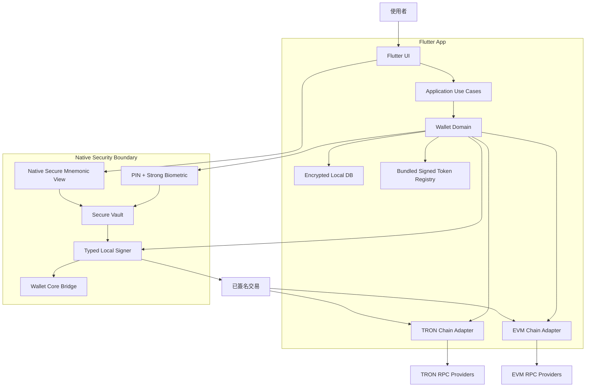
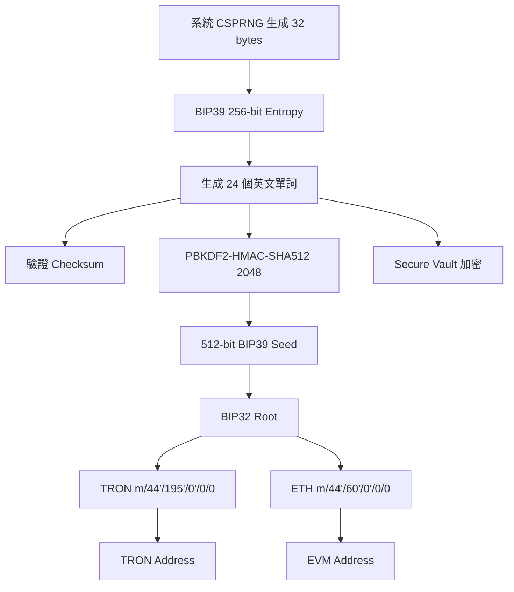
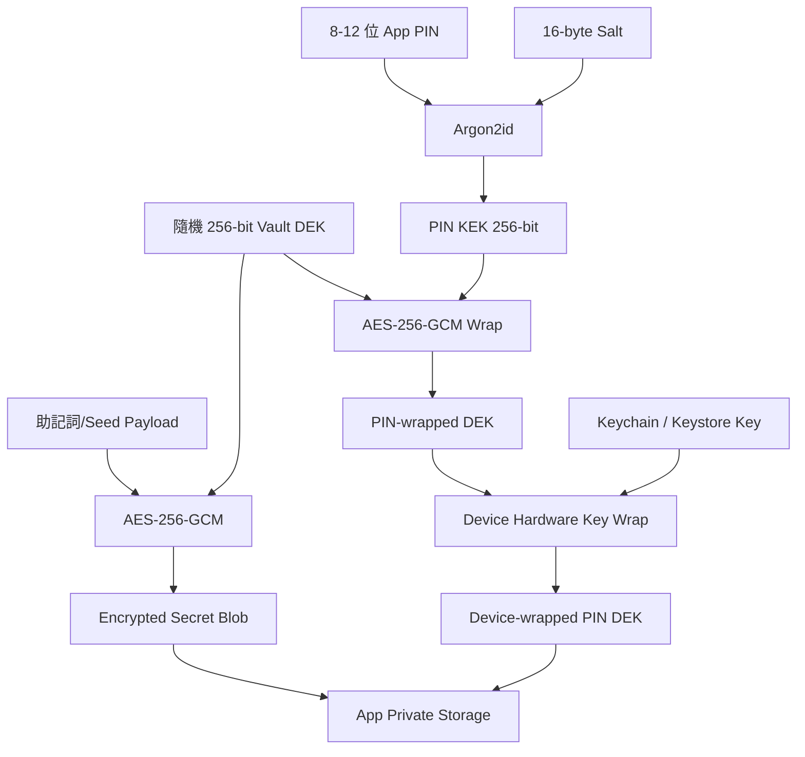
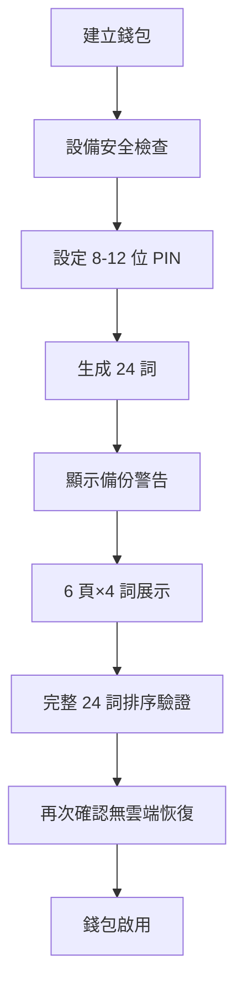
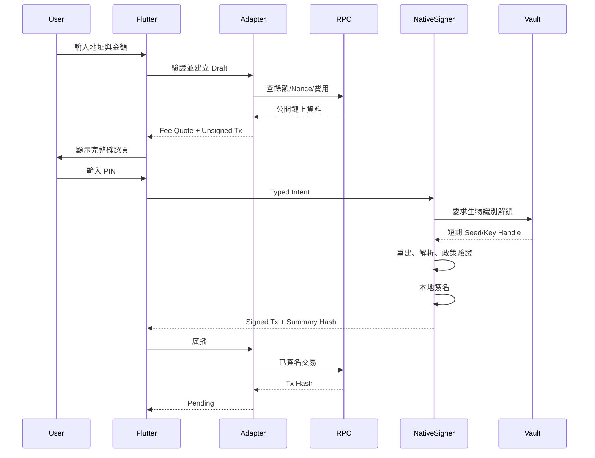

# 無後端非託管 Flutter 熱錢包 V1  
## 最高實用安全基線・完整開發規格

**文件版本：** 1.0  
**文件日期：** 2026-08-12  
**狀態：** 可直接進入開發  
**適用平台：** Android / iOS  
**客戶端框架：** Flutter  
**錢包核心：** Trust Wallet Core  
**首批網絡：** TRON、Ethereum  
**首批資產：** TRX、USDT-TRC20、ETH、USDT-ERC20  
**產品模式：** 非託管、自託管、無自建後端、手機本地簽名  
**主要讀者：** 產品負責人、Flutter 工程師、Android/iOS Native 工程師、區塊鏈工程師、安全工程師、QA

---

# 文件目錄

> 專案實際程式碼目錄與模組結構見 **第 5 章〈倉庫與模組結構〉**；以下為本開發規格的完整章節目錄。

1. [0. 文件目的與安全邊界](#section-0)
2. [1. 最終技術決策](#section-1)
3. [2. 產品宗旨](#section-2)
4. [3. 第一版範圍](#section-3)
5. [4. 無後端整體架構](#section-4)
6. [5. 倉庫與模組結構](#section-5)
7. [6. 密鑰、助記詞與派生規格](#section-6)
8. [7. Secure Vault 最高安全設計](#section-7)
9. [8. 助記詞備份與恢復 UX](#section-8)
10. [9. Trust Wallet Core 整合規格](#section-9)
11. [10. Chain Adapter 規格](#section-10)
12. [11. TRON 實現規格](#section-11)
13. [12. EVM 實現規格](#section-12)
14. [13. Token Registry](#section-13)
15. [14. 交易完整流程](#section-14)
16. [15. UI／UX 規格](#section-15)
17. [16. 本地資料模型](#section-16)
18. [17. App Lifecycle 與 Session](#section-17)
19. [18. 平台硬化](#section-18)
20. [19. 網絡安全與隱私](#section-19)
21. [20. 日誌、Crash 與監控](#section-20)
22. [21. 供應鏈與 CI/CD](#section-21)
23. [22. 測試策略](#section-22)
24. [23. 外部安全審計](#section-23)
25. [24. 開發階段與任務](#section-24)
26. [25. Definition of Done](#section-25)
27. [26. 主網開啟條件](#section-26)
28. [27. 已知限制與風險登記](#section-27)
29. [28. 第二階段後端規劃](#section-28)
30. [29. 開發啟動命令與環境](#section-29)
31. [30. 官方來源清單](#section-30)
32. [31. 最終交付要求](#section-31)

---

<a id="section-0"></a>
# 0. 文件目的與安全邊界

本文件用於直接交付開發團隊，作為第一版手機熱錢包的產品、架構、安全、UI、測試和驗收標準。開發團隊不得自行降低本文列出的安全要求；如需變更，必須提交書面 RFC，說明原因、風險、替代方案和回滾方案，經產品負責人與安全負責人共同批准後才能實施。

本文所稱「最高級別安全」是指：

> 在「手機熱錢包、Flutter 客戶端、第一版不建立自有後端」這個限制下，採用最高實用安全基線。

它不代表手機熱錢包能等同硬體錢包或離線冷錢包。當手機作業系統、核心、可信執行環境或使用者本人已完全被攻破時，任何熱錢包都無法作出絕對安全保證。因此：

- 第一版先只開放測試網。
- 主網功能必須由編譯時 Feature Flag 關閉。
- 未完成外部安全審計前，不得向公眾開放主網真實資金。
- 未完成助記詞備份驗證前，不得允許用戶接收主網資產。
- 不得把「程式可運行」當作「可以安全上線」。

---

<a id="section-1"></a>
# 1. 最終技術決策

## 1.1 必須採用

| 項目 | 決策 |
|---|---|
| App 框架 | Flutter |
| Flutter 基線 | 3.44.7 Stable；使用固定版本，不跟隨 `stable` 浮動 |
| iOS 構建 | Xcode 26.x Stable、iOS 26 SDK、Swift Package Manager |
| iOS 最低系統 | iOS 17.0 |
| Android 構建 | compileSdk / targetSdk 36 |
| Android 最低系統 | Android 10 / API 29 |
| Java | JDK 17，CI 與本地固定相同版本 |
| 錢包核心 | Trust Wallet Core 4.7.3 |
| Wallet Core Tag | `4.7.3` |
| Wallet Core Commit | `cf4d0ad2344bdb4412004bbdcedf502d4c4d4f17` |
| Wallet Core 原始碼包 SHA-256 | `b03b670188bbad74fb4f72b531e230733c5fa7e09a008ba3d22d1c40e7ed9433` |
| iOS XCFramework SHA-256 | `179b12764383479fe8ab02689872113ebdfcf923ca96896c133a31e516b038dc` |
| 助記詞 | BIP39、24 個英文單詞、256-bit Entropy |
| HD 派生 | BIP32 + BIP44 |
| TRON 路徑 | `m/44'/195'/0'/0/0` |
| Ethereum 路徑 | `m/44'/60'/0'/0/0` |
| 簽名曲線 | secp256k1 |
| 私鑰位置 | 只存在用戶手機本地 |
| 簽名位置 | 只在手機 Native 安全層完成 |
| 自有後端 | 第一版不建立 |
| UI | 全新自有 Flutter Design System，不 Fork Cake Wallet UI |
| 敏感 UI | 助記詞建立、導入、顯示採 Native Secure View，不讓完整助記詞進入 Dart Heap |
| 狀態管理 | Riverpod，固定精確版本 |
| 導航 | `go_router` 或自建 Router，固定精確版本 |
| 本地資料 | Drift + SQLCipher，僅保存非密鑰資料 |
| 測試網 | TRON Shasta/Nile、Ethereum Sepolia |
| 主網 | 外部安全審計完成後才開啟 |

## 1.2 明確禁止

第一版禁止加入以下功能：

- WalletConnect
- DApp Browser
- WebView
- 任意智能合約調用
- Blind Signing
- Swap
- Bridge
- NFT
- Staking
- Approve / Permit / SetApprovalForAll
- 自訂 Token
- 自訂助記詞單詞
- 中文助記詞
- 私鑰或助記詞雲端備份
- Email／手機號登入
- Firebase Authentication
- 服務器生成錢包
- 公司 Master Seed 派生全部用戶
- 把助記詞放入 SharedPreferences、Hive、SQLite、Firebase、日誌或 Crash Report
- 把 RPC Secret、API Secret 或私鑰寫入 App
- 從遠端下載並執行程式碼
- 在 Debug／模擬器版本啟用主網
- 使用來源不明的 Wallet Core Flutter Wrapper
- 使用 `master`、`main` 或未固定 Commit 的 Git 依賴
- 使用 `^` 浮動版本管理安全關鍵依賴

---

<a id="section-2"></a>
# 2. 產品宗旨

## 2.1 一句話宗旨

建立一個品牌完全自有、非託管、多鏈、穩定幣優先的手機熱錢包；用戶的 24 詞助記詞和私鑰只在用戶手機本地生成、加密、解密和簽名，平台、RPC 供應商及任何第三方永遠不能取得明文私鑰。

## 2.2 核心原則

1. **用戶自託管：** 用戶控制助記詞和資產，公司不託管私鑰。
2. **本地生成：** 建立錢包不需要網絡，不調用服務器。
3. **本地簽名：** 私鑰不離開設備，RPC 只接收已簽名交易。
4. **穩定幣優先：** 首頁和收付款流程以 USDT 為核心。
5. **最小攻擊面：** 第一版只允許四種明確交易。
6. **不盲簽：** Native Signer 必須自行解析並驗證交易。
7. **供應商可替換：** RPC、Indexer、Token Registry 全部經 Adapter 抽象。
8. **安全優先於兼容：** 安全能力不足的設備不允許建立或導入錢包。
9. **備份優先：** 完成 24 詞完整驗證後，錢包才進入可用狀態。
10. **主網後置：** 測試、審計、修復、灰度完成後才開主網。

---

<a id="section-3"></a>
# 3. 第一版範圍

## 3.1 必須完成的功能

### 錢包

- 建立 BIP39 24 詞錢包
- 導入 BIP39 12／15／18／21／24 詞錢包
- 驗證助記詞 Checksum
- 顯示 24 詞備份
- 完整 24 詞順序驗證
- 一台設備建立多個獨立錢包
- 每個錢包使用獨立 256-bit Entropy
- 刪除本地錢包
- 重新命名錢包
- 鎖定／解鎖錢包

### 網絡與資產

- TRON Mainnet 配置預留但默認禁用
- TRON Shasta 或 Nile 測試網
- Ethereum Mainnet 配置預留但默認禁用
- Ethereum Sepolia
- TRX
- TEST-USDT-TRC20
- ETH
- TEST-USDT-ERC20
- 審計後才加入正式 USDT 合約

### 收款

- 顯示完整地址
- 顯示 QR Code
- 複製地址
- 分享純地址文字
- 明確顯示網絡
- 檢測 QR Code 網絡和地址格式
- 不允許將 TRON 地址誤當 EVM 地址

### 轉帳

- TRX 轉帳
- TRC20 `transfer(address,uint256)`
- ETH 轉帳
- ERC20 `transfer(address,uint256)`
- 地址驗證
- 金額精度驗證
- 餘額驗證
- 手續費估算
- 手續費上限
- 交易確認頁
- PIN 驗證
- 強生物識別確認
- Native 本地簽名
- 廣播
- Pending／Confirmed／Failed 狀態
- 本地保存本 App 發出的交易

### 安全

- 8–12 位 App PIN
- Face ID／Touch ID／Android Class 3 Biometric
- Android Keystore／StrongBox
- iOS Keychain／Data Protection
- 敏感頁面保護
- 自動鎖定
- Root／Jailbreak／Hook／Debug／Emulator 風險檢測
- 本地資料庫加密
- 日誌脫敏
- 應用完整性檢查
- 依賴固定、SBOM、供應鏈掃描
- 外部安全審計入口

## 3.2 第一版不承諾

- 忘記助記詞後恢復
- 雲端同步
- 多設備同步
- 入帳 Push
- 完整全鏈歷史
- 卡片
- Nium／Bridge
- KYC／KYB
- 法幣出入金
- 服務器風控
- Play Integrity 遠端驗證
- Apple App Attest 遠端驗證
- 被完全 Root／Jailbreak 的設備仍可安全簽名

---

<a id="section-4"></a>
# 4. 無後端整體架構



## 4.1 服務器邊界

第一版不建立：

- 用戶資料庫
- 登入服務器
- 私鑰服務器
- 錢包服務器
- 後端簽名服務
- 公司 Master Seed
- 雲端助記詞備份
- Push 服務
- 遠端風控後台

第一版仍會連接外部：

- TRON RPC
- Ethereum RPC
- 可選區塊瀏覽器／Indexer
- 可選價格 API

外部服務全部視為不可信。它們只能提供公開鏈上資料或接收已簽名交易。

---

<a id="section-5"></a>
# 5. 倉庫與模組結構

```text
wallet-platform/
├── apps/
│   └── mobile/
│       ├── lib/
│       ├── android/
│       ├── ios/
│       └── integration_test/
│
├── packages/
│   ├── design_system/
│   ├── wallet_domain/
│   ├── wallet_application/
│   ├── secure_vault/
│   │   ├── dart_api/
│   │   ├── android/
│   │   └── ios/
│   ├── secure_mnemonic_view/
│   │   ├── android/
│   │   └── ios/
│   ├── wallet_core_bridge/
│   │   ├── dart_api/
│   │   ├── generated_ffi/
│   │   ├── android/
│   │   └── ios/
│   ├── chain_common/
│   ├── chain_tron/
│   ├── chain_evm/
│   ├── rpc_client/
│   ├── token_registry/
│   ├── encrypted_database/
│   ├── security_runtime/
│   ├── transaction_history/
│   └── observability/
│
├── native/
│   ├── wallet_security_core/
│   └── third_party/
│       └── wallet-core/
│
├── config/
│   ├── networks.test.json
│   ├── networks.production.json
│   ├── tokens.test.json
│   └── tokens.production.json
│
├── tools/
│   ├── build_wallet_core/
│   ├── verify_wallet_core_hash/
│   ├── sync_trust_assets/
│   ├── sign_token_manifest/
│   ├── generate_sbom/
│   └── scan_secrets/
│
├── docs/
│   ├── architecture.md
│   ├── threat-model.md
│   ├── key-lifecycle.md
│   ├── transaction-policy.md
│   ├── incident-response.md
│   └── release-runbook.md
│
├── .github/
│   ├── CODEOWNERS
│   ├── dependabot.yml
│   └── workflows/
│
├── pubspec.yaml
├── pubspec.lock
├── analysis_options.yaml
├── SECURITY.md
├── LICENSES.md
└── README.md
```

## 5.1 分層規則

- UI 不可直接調用 Wallet Core。
- UI 不可讀取助記詞或私鑰。
- Chain Adapter 不可取得私鑰。
- RPC Client 不可取得私鑰。
- Secure Vault 不負責查鏈。
- Signer 只接受定義明確的 Typed Transaction Intent。
- 不提供 `signRawBytes()`、`signArbitraryMessage()` 或 `signAnyTransaction()`。
- Token Registry 是交易政策的一部分，不只是 UI 資料。
- 所有安全策略同時在 Dart 層與 Native Signer 層驗證；Native 層是最終裁決者。

---

<a id="section-6"></a>
# 6. 密鑰、助記詞與派生規格

## 6.1 助記詞參數

| 參數 | 固定值 |
|---|---|
| 標準 | BIP39 |
| 單詞數 | 24 |
| 原始熵 | 256 bits / 32 bytes |
| Checksum | 8 bits |
| 單詞表 | BIP39 English |
| Passphrase | 第一版固定空字串 |
| Seed 長度 | 512 bits |
| Seed KDF | PBKDF2-HMAC-SHA512 |
| BIP39 Iterations | 2048，禁止自行修改 |
| Unicode | UTF-8 NFKD |
| 隨機來源 | iOS `SecRandomCopyBytes`；Android `SecureRandom`／系統 CSPRNG |
| 禁止來源 | Dart `Random`、時間戳、UUID、裝置 ID、伺服器隨機數 |

BIP39 的 2048 次 PBKDF2 是互操作標準，不得為了「看起來更安全」自行增加，否則會導致與其他 BIP39 錢包不兼容。額外的本地保護由 Secure Vault 的 Argon2id 和硬件密鑰完成。

## 6.2 錢包生成流程



## 6.3 多錢包規則

每個錢包必須：

- 獨立生成 32 bytes Entropy。
- 使用獨立 Vault DEK、DBK、PIN Salt 和 Wallet UUID。
- 不得從公司種子派生。
- 不得從另一個用戶錢包派生。
- 不得重用 Nonce、Salt 或 DEK。
- 不得在建立後保留原始 Entropy 的多份副本。

## 6.4 地址派生

第一版固定使用：

```text
TRON:     m/44'/195'/0'/0/0
Ethereum: m/44'/60'/0'/0/0
```

第一版只使用 `account = 0`、`change = 0`、`address_index = 0`。不要提前提供自訂派生路徑 UI。未來新增多帳戶時，必須另行定義兼容性規格和 Account Discovery。

## 6.5 Passphrase

第一版不提供 BIP39 額外 Passphrase，原因：

- 任意 Passphrase 都會生成有效但不同的錢包。
- 拼寫、空格、大小寫錯誤不會報錯，只會顯示空錢包。
- 客服無法辨別是錯誤 Passphrase 還是資產丟失。
- 大幅提高普通用戶永久丟失資產的風險。

未來如加入，必須放在「Advanced Security」並設置獨立風險教育與恢復測試。

---

<a id="section-7"></a>
# 7. Secure Vault 最高安全設計

## 7.1 密鑰階層

每個 Wallet Profile 建立以下隨機值：

| 名稱 | 長度 | 用途 |
|---|---:|---|
| `wallet_entropy` | 32 bytes | 生成 BIP39 24 詞 |
| `vault_dek` | 32 bytes | 加密助記詞／Seed Payload |
| `db_key` | 32 bytes | 加密本地 SQLCipher DB |
| `pin_salt` | 16 bytes | Argon2id Salt |
| `payload_nonce` | 12 bytes | AES-256-GCM Nonce |
| `pin_wrap_nonce` | 12 bytes | PIN 包裝層 Nonce |
| `device_wrap_nonce` | 12 bytes | 設備包裝層 Nonce |
| `wallet_uuid` | 16 bytes | 隨機 Wallet ID，不由地址推導 |

## 7.2 加密層



解鎖需要：

1. 設備硬件／系統認證成功。
2. 取得設備包裝層。
3. 用戶輸入 App PIN。
4. Argon2id 派生 PIN KEK。
5. 解包 Vault DEK。
6. 解密助記詞或 Seed。
7. 在 Native 記憶體中完成簽名。
8. 立即清除敏感記憶體。

## 7.3 加密參數

### Payload 與 Key Wrap

- 演算法：AES-256-GCM。
- Key：256 bits。
- Nonce：96 bits，每次加密使用全新隨機值。
- Authentication Tag：128 bits。
- AAD 必須包含：
  - Vault Schema Version
  - Wallet UUID
  - Platform
  - Bundle ID / Application ID
  - Record Type
  - Derivation Profile ID
- 任意驗證失敗必須返回統一 `VaultIntegrityException`，不得嘗試使用未驗證明文。
- 每次寫入採 temporary file + `fsync` + atomic rename。
- 不允許原地覆寫造成一半新、一半舊的 Vault。

### PIN KDF

固定最低參數：

```text
Algorithm:   Argon2id v1.3
Memory:      64 MiB minimum
Iterations:  3 minimum
Parallelism: 4 preferred; low-end device minimum 2
Salt:        16 random bytes
Output:      32 bytes
Target time: 750–1200 ms on supported device
```

實際參數在首次建立時按設備校準，但任何設備不得低於：

```text
m = 65536 KiB
t = 3
p = 2
```

參數必須存入 Vault Header，以便未來升級。升級 KDF 時採「成功解鎖後重新包裝」，不得更改 BIP39 Seed。

## 7.4 PIN 政策

- 長度：8–12 位數字。
- 禁止 6 位 PIN。
- 禁止連續：`12345678`、`87654321`。
- 禁止重複：`11111111`。
- 禁止生日類弱 PIN 提示，但第一版不收集生日。
- 不允許系統鍵盤學習 PIN。
- 使用 Native Secure Numeric Keypad。
- PIN 不進入 Dart String。
- PIN 不寫入剪貼板。
- PIN 不寫入日誌。
- PIN 比較採常數時間。
- 失敗計數需帶 MAC，防止普通資料篡改。

失敗策略：

| 連續錯誤 | 處理 |
|---:|---|
| 1–4 | 立即重試 |
| 5 | 鎖定 30 秒 |
| 6 | 鎖定 1 分鐘 |
| 7 | 鎖定 5 分鐘 |
| 8 | 鎖定 30 分鐘 |
| 9 | 鎖定 6 小時 |
| 10 | 本地 Vault 永久鎖定，只能用 24 詞重新導入 |

默認不自動刪除資產密鑰，避免未備份用戶因誤觸永久損失。只有在已完成完整備份驗證後，才可讓用戶主動開啟「10 次失敗後安全清除」。

## 7.5 Android 實現

最低要求：

- Android 10 / API 29。
- 必須有裝置鎖屏密碼。
- 必須有 `BIOMETRIC_STRONG`。
- 使用 `AndroidKeyStore`。
- 優先 StrongBox；不支援時要求至少 TEE。
- 若 `KeyInfo.securityLevel == SOFTWARE`，禁止建立或導入錢包。
- 交易簽名使用 `BiometricPrompt` + `CryptoObject`。
- Hardware Key 設為 auth-per-use。
- 生物識別新增／變更後令密鑰失效。
- App 必須在建立錢包前提示：更改生物識別可能要求用 24 詞重新恢復。

建議 Key 配置：

```kotlin
KeyGenParameterSpec.Builder(
    alias,
    KeyProperties.PURPOSE_ENCRYPT or KeyProperties.PURPOSE_DECRYPT
)
    .setBlockModes(KeyProperties.BLOCK_MODE_GCM)
    .setEncryptionPaddings(KeyProperties.ENCRYPTION_PADDING_NONE)
    .setKeySize(256)
    .setUserAuthenticationRequired(true)
    .setUserAuthenticationParameters(
        0,
        KeyProperties.AUTH_BIOMETRIC_STRONG
    )
    .setInvalidatedByBiometricEnrollment(true)
    .setUnlockedDeviceRequired(true)
```

> 實作注意：`setUserAuthenticationParameters(...)` 只在 API 30+ 使用。Android 10 / API 29 必須放在版本分支中，使用平台支援的 auth-per-use 舊 API 建立等效限制；不得因 API 差異直接取消硬件認證要求。

若 StrongBox 可用：

```kotlin
.setIsStrongBoxBacked(true)
```

捕獲 `StrongBoxUnavailableException` 後可回退 TEE，但不得回退純軟體 KeyStore。

## 7.6 iOS 實現

最低要求：

- iOS 17。
- 必須設置設備 Passcode。
- 必須已註冊 Face ID 或 Touch ID。
- Keychain Item 使用：
  - `kSecAttrAccessibleWhenPasscodeSetThisDeviceOnly`
  - `kSecAttrSynchronizable = false`
  - `biometryCurrentSet`
- Keychain Item 不進入 iCloud、不隨備份移機。
- 生物識別集合改變時，本地密鑰失效，要求助記詞恢復。
- `LAContext` 每次簽名重新建立，不長時間重用。
- App 進入背景立即撤銷解鎖 Session。

## 7.7 Native Secure Mnemonic View

最高安全模式下，完整助記詞不得進入 Dart Heap，因為 Dart `String` 是不可變物件，無法保證即時覆寫清除。

必須建立兩個 Native Platform View：

```text
SecureMnemonicCreateView
SecureMnemonicImportView
```

功能：

- 在 Native 層生成／讀取助記詞。
- Native 層直接渲染單詞。
- Flutter 只收到：
  - `completed`
  - `cancelled`
  - `wallet_public_bundle`
  - 錯誤碼
- 不把單詞透過 MethodChannel 傳給 Dart。
- 不允許複製、分享、截圖按鈕。
- Android 全頁 `FLAG_SECURE`。
- iOS 監測螢幕錄製／Mirror，進入 Captured 狀態時立即遮蔽。
- iOS 無法從系統層百分之百阻止所有截圖，因此必須顯示明確警告，並在收到 screenshot notification 後立刻隱藏內容及記錄本地安全事件。
- 顯示方式使用 6 頁 × 4 詞，降低單張畫面暴露全部助記詞的風險。
- 完成後清除 View、Text Buffer、Controller 和 Native Secure Buffer。

## 7.8 記憶體清理

- 助記詞和私鑰只使用可覆寫的 Native Byte Buffer。
- 不使用長生命週期 Singleton 保存 Seed。
- 不使用 Dart `String` 保存助記詞、PIN、私鑰。
- 完成簽名後立即 `zeroize`。
- App 進入背景、鎖屏、截圖錄製、記憶體警告或進程即將終止時清理 Session。
- Crash Handler 不得 dump 敏感記憶體。
- Release Build 關閉 Native Core Dump。
- 不得在例外內容中包含密鑰、交易原文或完整 RPC Response。

---

<a id="section-8"></a>
# 8. 助記詞備份與恢復 UX

## 8.1 建立流程



## 8.2 必須顯示的警告

- 我們不保存你的助記詞。
- 手機遺失且沒有 24 詞，資產永久無法恢復。
- 不要截圖。
- 不要保存在相簿、Email、雲端硬碟、聊天軟體或備忘錄。
- 不要把 24 詞交給客服。
- 正式客服永遠不會索取助記詞。
- 建議手寫兩份並分開保存；大額資產建議使用金屬備份或硬體錢包。

## 8.3 驗證方式

最高安全版本要求完整驗證 24 個位置，不只抽查 3–4 個詞。

- 單詞選項每一頁重新打亂。
- 不顯示原助記詞頁。
- 錯誤時只顯示位置錯誤，不顯示正確答案。
- 完成前禁止接收主網資產。
- 測試網可允許跳過，但 UI 持續顯示「未備份」。

## 8.4 導入

- 支援 12／15／18／21／24 詞。
- 只接受 BIP39 English。
- 即時 NFKD 正規化。
- 僅在完成全部輸入後驗證 Checksum。
- 不把助記詞提交至任何網絡。
- 導入時開啟飛航模式仍必須可完成地址派生。
- 導入完成後，Native 層返回公開地址，不返回助記詞。

---

<a id="section-9"></a>
# 9. Trust Wallet Core 整合規格

## 9.1 版本固定

只允許使用：

```text
Repository: trustwallet/wallet-core
Tag:        4.7.3
Commit:     cf4d0ad2344bdb4412004bbdcedf502d4c4d4f17
License:    Apache-2.0
```

不得直接依賴 `master`。

## 9.2 構建策略

優先方案：

1. CI 從固定 Commit 拉取原始碼。
2. 驗證 Git Commit 和原始碼包 SHA-256。
3. 在受控 CI Runner 編譯 iOS／Android 產物。
4. 生成產物 SHA-256。
5. 把產物與 SBOM 一起存入 Release Artifact。
6. App 構建只使用已批准產物。

禁止：

- 下載來源不明 `.so`、`.aar`、`.framework`。
- 使用個人網盤二進位。
- 使用未固定版本的 pub.dev Wallet Core Wrapper。
- 在 CI 中執行未審查的遠端 shell script。

## 9.3 Flutter Bridge

Trust Wallet Core 倉庫中的 Flutter FFI 目錄可作為參考，但正式產品必須建立自有 `wallet_core_bridge`，提供最小 API。

允許暴露給 Dart 的 API：

```dart
abstract interface class WalletPublicApi {
  Future<WalletPublicBundle> createWallet();
  Future<WalletPublicBundle> importWalletNative();
  Future<WalletPublicBundle> getPublicBundle(String walletId);
  Future<void> deleteWallet(String walletId);
  Future<SignResult> sign(TransactionIntent intent);
}
```

禁止暴露：

```dart
String getMnemonic();
Uint8List getPrivateKey();
Uint8List signRawBytes(Uint8List bytes);
Uint8List signUnknownTransaction(Uint8List bytes);
```

助記詞顯示必須由 Native Secure View 單獨處理。

## 9.4 Typed Signer

只允許四種 Intent：

```dart
sealed class TransactionIntent {}

final class TronNativeTransferIntent extends TransactionIntent {
  final String walletId;
  final String from;
  final String to;
  final BigInt amountSun;
  final TronUnsignedTransaction unsignedTransaction;
}

final class Trc20TransferIntent extends TransactionIntent {
  final String walletId;
  final String tokenAssetId;
  final String from;
  final String to;
  final BigInt tokenAmount;
  final BigInt feeLimitSun;
  final TronUnsignedTransaction unsignedTransaction;
}

final class EvmNativeTransferIntent extends TransactionIntent {
  final String walletId;
  final BigInt chainId;
  final String from;
  final String to;
  final BigInt valueWei;
  final EvmFee fee;
  final BigInt nonce;
}

final class Erc20TransferIntent extends TransactionIntent {
  final String walletId;
  final BigInt chainId;
  final String tokenAssetId;
  final String tokenContract;
  final String from;
  final String to;
  final BigInt tokenAmount;
  final EvmFee fee;
  final BigInt nonce;
}
```

Native Signer 收到 Intent 後必須自行：

- 從 Token Registry 取出真實 Contract、Decimals 和 Network。
- 重新驗證 From Address 是否由指定 Wallet 派生。
- 驗證 To Address。
- 驗證 Chain ID。
- 驗證 Method Selector。
- 驗證 Token Contract。
- 驗證 Amount。
- 驗證 Fee Cap。
- 重新編碼交易。
- 生成可供 UI 顯示的 Signing Summary Hash。
- 只有全部一致才簽名。

---

<a id="section-10"></a>
# 10. Chain Adapter 規格

## 10.1 共用介面

```dart
abstract interface class ChainAdapter {
  ChainFamily get family;

  Future<ChainStatus> healthCheck();
  Future<BigInt> getNativeBalance(String address);
  Future<BigInt> getTokenBalance(String address, TokenDefinition token);
  Future<FeeQuote> estimateFee(TransactionDraft draft);
  Future<UnsignedTransaction> buildUnsigned(TransactionDraft draft);
  Future<String> broadcast(SignedTransaction transaction);
  Future<TransactionStatus> getTransactionStatus(String txHash);
  bool validateAddress(String address);
  String normalizeAddress(String address);
}
```

## 10.2 RPC 原則

- 至少配置 3 個獨立 Endpoint。
- 每個 Endpoint 有獨立 Timeout、重試、熔斷器。
- 每次 Response 驗證 Chain ID／Network。
- 關鍵查詢可使用雙供應商比對。
- API Key 視為公開資訊，不把高權限 Secret 放入 App。
- 不允許 HTTP。
- TLS 最低 1.2，優先 1.3。
- 只對公司控制的 Endpoint 實施 SPKI Pinning。
- 公共／自訂 RPC 無法穩定 Pin 時，使用系統 TLS Trust Store並顯示「自訂 RPC 風險」。
- RPC Response 不得直接驅動簽名；必須通過格式、範圍、Network 和 Policy 驗證。

## 10.3 Endpoint Failover

```text
Primary Request
  ├─ 成功且資料合法 → 使用
  ├─ Timeout → Secondary
  ├─ Chain ID 錯誤 → 永久熔斷該 Endpoint
  ├─ 格式錯誤 → 熔斷 10 分鐘
  └─ 關鍵資料不一致 → Block Signing + 顯示節點異常
```

## 10.4 無後端 API Key 原則

任何打包在 APK／IPA 的 Key 都可以被逆向提取，因此：

- 不使用具有資金、管理或高權限的 Secret。
- 只使用可公開、可撤銷、可限流的 Client Key。
- Provider 帳戶必須設定每日限額。
- 每個 App 環境使用不同 Key。
- Debug、Staging、Production 完全隔離。
- 供應商帳戶開啟異常流量警報。

---

<a id="section-11"></a>
# 11. TRON 實現規格

## 11.1 支援

第一版只支援：

- TRX TransferContract
- TRC20 `transfer(address,uint256)`

禁止：

- AccountPermissionUpdate
- Freeze／Unfreeze
- Delegate Resource
- Vote
- Trigger 任意合約
- Deploy Contract
- Multisig
- 任意 ABI
- 自訂 Contract Call

## 11.2 地址

- 驗證 Base58Check。
- Mainnet 地址需符合 TRON Prefix。
- 顯示完整地址。
- QR 解析後再次驗證。
- 不接受 EVM `0x...` 作為收款地址。
- 不依賴「字串以 T 開頭」作為唯一驗證。

## 11.3 TRC20 交易

Native Signer 必須驗證：

- Contract 等於 Bundled Signed Token Registry 中的 Contract。
- ABI Method 必須是 `transfer(address,uint256)`。
- Selector 必須正確。
- 接收地址解碼後與 UI 顯示地址一致。
- Amount 與 UI 顯示值經 Decimals 換算後一致。
- `fee_limit` 不超過本地政策上限。
- Expiration 不超過當前時間後合理窗口。
- Reference Block 資料格式有效。
- 不允許額外 Contract 或多操作 Transaction。

## 11.4 Energy／Bandwidth

- 轉帳前查詢估算資源。
- 顯示「預估」而非保證。
- 檢查帳戶是否有足夠 TRX／Energy。
- 不自動質押 TRX。
- 不自動租 Energy。
- 不自動調用第三方資源服務。
- 預估費用高於本地上限時禁止簽名。
- 費用高於轉帳金額 5% 時顯示高風險二次確認；高於硬上限則直接阻止。

---

<a id="section-12"></a>
# 12. EVM 實現規格

## 12.1 支援

第一版只支援：

- Native ETH Transfer
- ERC20 `transfer(address,uint256)`

禁止：

- `approve`
- `permit`
- `transferFrom`
- `setApprovalForAll`
- `delegatecall`
- 任意合約
- EIP-712 任意簽名
- Personal Sign
- WalletConnect
- EIP-7702 授權
- Batch／Multicall

## 12.2 地址

- 驗證 20-byte 地址。
- 統一顯示 EIP-55 Checksum 格式。
- Mixed-case 地址必須通過 Checksum。
- 全小寫輸入可接受，但確認頁轉成 Checksum。
- 禁止 Zero Address。
- 對新地址顯示「首次轉帳」提示。
- 地址簿條目修改後，第一次使用必須重新確認完整地址。

## 12.3 交易

Native Signer 必須驗證：

- `chainId` 等於當前 Network。
- `from` 等於本地派生地址。
- `to` 合法。
- `nonce` 為非負值。
- `gasLimit` 合理。
- EIP-1559 的 `maxFeePerGas >= maxPriorityFeePerGas`。
- Fee 不超過 Hard Cap。
- Native Transfer 的 `data` 必須為空。
- ERC20 的 `value` 必須為 0。
- ERC20 `data` 只能是 `transfer(address,uint256)`。
- Contract 必須在 Token Registry。
- 不允許 Access List 中出現非預期資料。
- 不允許 Blob／未知交易類型。
- 簽名後重新解碼 Raw Transaction，確認欄位未改變。

## 12.4 Nonce

- 從 RPC 讀取 Pending Nonce。
- 交易建立到簽名超過 30 秒時重新查詢。
- 同一地址同一 Nonce 只允許一筆本地 Pending。
- 第一版不提供 Speed Up／Cancel。
- RPC 間 Nonce 不一致時禁止簽名。

---

<a id="section-13"></a>
# 13. Token Registry

## 13.1 原則

Trust Wallet Assets 只作為 Logo 和 Metadata 的候選來源，不是安全信任根。

正式 Token Manifest 必須：

- 由公司安全團隊離線審核。
- 合約地址從發行方官方來源交叉核對。
- 由離線 Ed25519 私鑰簽名。
- App 內嵌 Manifest、公鑰和 Signature。
- 啟動時驗證 Signature。
- 驗證失敗時只顯示 Native Coin，禁用 Token Transfer。
- 第一版不提供遠端更新；更新隨 App Release 發布。

## 13.2 Manifest 範例

```json
{
  "schema_version": 1,
  "environment": "test",
  "generated_at": "2026-08-12T00:00:00Z",
  "assets": [
    {
      "asset_id": "tron:shasta/trc20:TEST_CONTRACT",
      "network": "tron-shasta",
      "type": "trc20",
      "symbol": "TEST-USDT",
      "name": "Test USDT",
      "contract": "TEST_CONTRACT",
      "decimals": 6,
      "logo_sha256": "REPLACE",
      "transfer_enabled": true
    },
    {
      "asset_id": "eip155:11155111/erc20:TEST_CONTRACT",
      "network": "ethereum-sepolia",
      "type": "erc20",
      "symbol": "TEST-USDT",
      "name": "Test USDT",
      "contract": "TEST_CONTRACT",
      "decimals": 6,
      "logo_sha256": "REPLACE",
      "transfer_enabled": true
    }
  ]
}
```

## 13.3 測試 Token 命名

測試網資產不得顯示為真實 `USDT`，必須顯示：

```text
TEST-USDT
Testnet Only
No Real Value
```

避免用戶誤認為真實資產。

---

<a id="section-14"></a>
# 14. 交易完整流程



## 14.1 確認頁必須顯示

- 資產名稱
- 網絡
- 完整 From
- 完整 To
- 金額
- Token Contract
- Token Decimals
- 預估 Network Fee
- 最大可能 Fee
- 轉帳後預估餘額
- 首次地址／新地址警告
- 高費用警告
- 測試網標識
- 交易政策 ID
- 禁止只顯示截斷地址

## 14.2 簽名前二次驗證

- App PIN。
- 強生物識別。
- 如果 App 從背景恢復，重新驗證。
- 如果交易資料變動，舊的驗證立即失效。
- 驗證 Session 只對該筆 Signing Summary Hash 有效。
- 不允許驗證一次後批量簽多筆。

---

<a id="section-15"></a>
# 15. UI／UX 規格

## 15.1 設計方向

- 原創 Fintech 風格。
- 不照搬 Cake Wallet。
- 不照搬 Trust Wallet 商標或受保護視覺元素。
- 使用自有 Design Tokens。
- 使用系統字體。
- 不遠端載入字體。
- 不使用 Web UI。
- 不使用動態 HTML。
- 每個 Token 必須清楚標識 Network。
- USDT 和收付款是首頁主體。
- 安全警告不使用容易忽略的 Toast。

## 15.2 底部導航

第一版只保留：

```text
首頁 | 活動 | 設定
```

不加入：

```text
市場 | DApp | NFT | Swap | Earn
```

## 15.3 首頁

```text
┌──────────────────────────────┐
│ Wallet 1               🔒    │
│                              │
│ 總資產                        │
│ 10,250.00 USDT               │
│                              │
│ [ 收款 ]       [ 轉帳 ]       │
├──────────────────────────────┤
│ USDT        TRON             │
│ 8,000.00                     │
│                              │
│ USDT        Ethereum         │
│ 2,250.00                     │
├──────────────────────────────┤
│ TRX                          │
│ 120.00                       │
│                              │
│ ETH                          │
│ 0.15                         │
├──────────────────────────────┤
│ 首頁        活動        設定  │
└──────────────────────────────┘
```

## 15.4 必須完成的畫面

1. Splash／完整性檢查
2. 歡迎頁
3. 建立錢包／導入錢包
4. 設備安全資格檢查
5. 設定 PIN
6. Native 助記詞展示
7. Native 助記詞完整驗證
8. 首頁
9. 資產詳情
10. 收款選網絡
11. 收款 QR
12. 轉帳選資產
13. 掃描 QR
14. 地址與金額輸入
15. 手續費估算
16. 完整交易確認
17. 生物識別簽名
18. Pending
19. Success／Failed
20. 活動列表
21. 錢包管理
22. 安全設定
23. RPC 設定
24. 備份提醒
25. 刪除錢包
26. Root／Jailbreak Read-only 畫面

## 15.5 安全 UX

- 助記詞頁離開即鎖定。
- 轉帳確認頁不允許背景停留超過 30 秒。
- 地址在確認頁提供逐字分組，提高核對能力。
- 從剪貼板貼上地址後顯示「請核對剪貼板內容，惡意軟體可能替換地址」。
- 不自動讀取剪貼板。
- 複製地址後 60 秒嘗試清理剪貼板。
- 禁止複製助記詞和私鑰。
- 第一版不提供私鑰匯出 UI。
- 助記詞顯示必須 PIN + 生物識別。
- 刪除錢包需輸入完整錢包名稱 + PIN + 生物識別。

---

<a id="section-16"></a>
# 16. 本地資料模型

## 16.1 機密分類

### Critical Secret

- 助記詞
- Seed
- 私鑰
- Vault DEK
- DB Key
- PIN KEK

只能存在 Secure Vault／Native Secure Memory。

### Sensitive Public Data

- 地址
- 餘額
- 交易記錄
- RPC Endpoint
- 地址簿
- Wallet 名稱

存入 SQLCipher。

### Non-sensitive

- Theme
- 語言
- App Version
- 非個人化功能開關

仍建議存入加密 DB，避免資料結構分散。

## 16.2 表結構

```sql
CREATE TABLE wallets (
  wallet_id TEXT PRIMARY KEY,
  display_name TEXT NOT NULL,
  created_at INTEGER NOT NULL,
  backup_verified INTEGER NOT NULL,
  security_profile TEXT NOT NULL,
  vault_schema_version INTEGER NOT NULL
);

CREATE TABLE accounts (
  account_id TEXT PRIMARY KEY,
  wallet_id TEXT NOT NULL,
  network_id TEXT NOT NULL,
  address TEXT NOT NULL,
  derivation_path TEXT NOT NULL,
  created_at INTEGER NOT NULL,
  UNIQUE(wallet_id, network_id, derivation_path)
);

CREATE TABLE assets (
  asset_id TEXT PRIMARY KEY,
  network_id TEXT NOT NULL,
  type TEXT NOT NULL,
  symbol TEXT NOT NULL,
  contract TEXT,
  decimals INTEGER NOT NULL,
  enabled INTEGER NOT NULL
);

CREATE TABLE transactions (
  local_id TEXT PRIMARY KEY,
  wallet_id TEXT NOT NULL,
  network_id TEXT NOT NULL,
  tx_hash TEXT,
  direction TEXT NOT NULL,
  asset_id TEXT NOT NULL,
  from_address TEXT NOT NULL,
  to_address TEXT NOT NULL,
  amount_atomic TEXT NOT NULL,
  fee_atomic TEXT,
  status TEXT NOT NULL,
  created_at INTEGER NOT NULL,
  updated_at INTEGER NOT NULL
);

CREATE TABLE rpc_endpoints (
  endpoint_id TEXT PRIMARY KEY,
  network_id TEXT NOT NULL,
  base_url TEXT NOT NULL,
  priority INTEGER NOT NULL,
  is_custom INTEGER NOT NULL,
  enabled INTEGER NOT NULL
);

CREATE TABLE security_events (
  event_id TEXT PRIMARY KEY,
  event_type TEXT NOT NULL,
  severity TEXT NOT NULL,
  occurred_at INTEGER NOT NULL,
  details_redacted TEXT
);
```

不得在任何表中加入：

```text
mnemonic
seed
private_key
pin
pin_hash_debug
raw_secret
```

---

<a id="section-17"></a>
# 17. App Lifecycle 與 Session

## 17.1 自動鎖定

| 事件 | 行為 |
|---|---|
| App 進入背景 | 15 秒內鎖定；敏感頁立即鎖定 |
| 無操作 | 2 分鐘鎖定 |
| 螢幕鎖定 | 立即鎖定 |
| 螢幕錄製 | 隱藏敏感內容並鎖定 |
| 記憶體警告 | 清除所有解密 Session |
| Process Kill | 不保留任何解密 Session |
| 網絡切換 | 不影響 Vault，但未簽交易重新估費 |
| 生物識別變更 | Vault 失效，要求 24 詞恢復 |
| 時間大幅回撥 | 鎖定並重新建立交易 |

## 17.2 Session

- Vault DEK 解密後只保留於 Native Secure Memory。
- 最大生命週期 120 秒。
- 每次簽名後立即清除私鑰。
- App 解鎖不等於交易授權。
- 每筆交易都需新的生物識別確認。
- PIN 驗證狀態最多保留到 App 進入背景。

---

<a id="section-18"></a>
# 18. 平台硬化

## 18.1 Android

Manifest 必須：

```xml
<application
    android:allowBackup="false"
    android:fullBackupContent="false"
    android:usesCleartextTraffic="false"
    android:debuggable="false"
    android:extractNativeLibs="false">
</application>
```

另外：

- 使用 Data Extraction Rules 排除所有 Wallet Data。
- 敏感 Activity 使用 `FLAG_SECURE`。
- 轉帳確認和 PIN 元件使用 `filterTouchesWhenObscured`。
- 檢查 Overlay／Obscured Touch。
- 所有 Component 明確設定 `android:exported`。
- 除 Launcher 和已驗證 App Link 外，不導出 Component。
- 禁止自訂 URL Scheme 執行交易。
- Deep Link 只能導航到公開頁，不可攜帶簽名指令。
- Release 開啟 R8／資源縮減。
- Dart 使用 `--obfuscate --split-debug-info`，但不得把 Obfuscation 當安全邊界。
- Native Symbol 單獨保存在安全 Release Storage。
- Debug Build 使用不同 Application ID。
- Debug Build 禁止主網。
- 模擬器禁止主網。

## 18.2 iOS

- 使用 ATS，禁止 `NSAllowsArbitraryLoads`。
- Keychain 不允許 Synchronizable。
- 敏感畫面進入 App Switcher 時加遮罩。
- 監測 `UIScreen.isCaptured`。
- 收到截圖通知後立即隱藏助記詞。
- Universal Links 只處理公開導航。
- 不使用可執行遠端 JS。
- 不使用 WebView。
- Debug／Staging／Production 使用不同 Bundle ID。
- TestFlight 測試包預設禁主網。
- Release Symbols 存入安全 Crash Symbol Storage。
- Crash Report 上傳前本地脫敏。

## 18.3 Root／Jailbreak

檢測信號：

- 已知 Root／Jailbreak 路徑
- 可疑 Mount
- 可寫 System 目錄
- Su／Magisk
- Frida／Substrate／Hook
- Debugger
- Emulator
- App Signature 異常
- Bundle／APK 篡改
- 動態 Library Injection
- 異常 Proxy／CA

策略：

```text
無風險：
  正常使用

中風險：
  顯示警告、縮短 Session、每次操作重新驗證

高風險／Root／Jailbreak：
  Read-only
  禁止建立、導入、顯示助記詞、簽名與刪除
  允許查看公開地址與餘額
```

Root／Jailbreak 檢測可被繞過，因此它只是縱深防禦，不是唯一安全邊界。

---

<a id="section-19"></a>
# 19. 網絡安全與隱私

## 19.1 禁止明文

- 禁止 HTTP。
- 禁止跳過 TLS 驗證。
- 禁止自訂 Trust-All Certificate。
- 禁止 Release Build 接受 User-installed CA 作為測試後門。
- 禁止把 TLS 驗證錯誤轉為 Warning 後繼續。

## 19.2 Pinning

對公司控制的 Endpoint：

- 使用 SPKI Pinning。
- 至少配置兩個有效 Pin。
- 保留一個離線 Backup Pin。
- Pin 更新必須透過 App Release。
- Pin 驗證失敗時 Fail Closed。

對第三方公共 RPC：

- 若供應商無穩定 Pin 政策，不強行 Pin CDN 臨時證書。
- 使用系統 Trust Store。
- 驗證 Hostname、Chain ID 和 Response。
- 允許用戶選擇自訂 RPC，但顯示風險並禁用 Pinning 保證。

## 19.3 隱私

- 不收集助記詞、私鑰、PIN。
- 默認不啟用第三方 Analytics。
- RPC 供應商會看到查詢地址，隱私政策需明確說明。
- Price API 不得接收 Wallet Address。
- Crash Report 不包含地址、交易原文、RPC Header。
- 本地地址可在日誌中用 `HMAC(app_session_key, address)` 產生短期 Alias。
- 不跨 Session 使用固定地址 Hash，避免追蹤。

---

<a id="section-20"></a>
# 20. 日誌、Crash 與監控

## 20.1 日誌等級

Release 只允許：

```text
ERROR
WARN
必要的 INFO
```

禁止記錄：

- 助記詞
- 私鑰
- PIN
- Seed
- Vault Ciphertext
- 完整交易 Raw Data
- 完整地址
- RPC Authorization Header
- API Key
- 生物識別結果細節
- SQLCipher Key
- Token Manifest 私鑰

## 20.2 錯誤碼

使用結構化錯誤：

```text
VAULT_AUTH_FAILED
VAULT_LOCKED
VAULT_INTEGRITY_FAILED
DEVICE_SECURITY_UNSUPPORTED
MNEMONIC_CHECKSUM_INVALID
ADDRESS_INVALID
NETWORK_MISMATCH
RPC_CHAIN_ID_MISMATCH
RPC_DATA_INCONSISTENT
FEE_LIMIT_EXCEEDED
TOKEN_POLICY_DENIED
SIGNING_POLICY_DENIED
BROADCAST_FAILED
TRANSACTION_EXPIRED
```

UI 顯示安全且可理解的文字；技術細節只保留脫敏版本。

---

<a id="section-21"></a>
# 21. 供應鏈與 CI/CD

## 21.1 Git 規則

- `main` 禁止直接 Push。
- 至少 2 人 Review。
- 安全關鍵目錄需要 Security CODEOWNER。
- Wallet Core、Vault、Signer、Transaction Policy 變更必須由安全負責人批准。
- Commit 和 Release Tag 必須簽名。
- 禁止 Force Push 到受保護分支。
- PR 必須關聯 Issue／Threat／Test。
- 第三方依賴新增必須提供 License、維護狀態、最近 Release、安全記錄。

## 21.2 依賴

- `pubspec.lock` 必須提交。
- 安全關鍵依賴使用精確版本。
- GitHub Actions 必須固定完整 Commit SHA，不使用浮動 Tag。
- 每次 Release 生成 CycloneDX SBOM。
- 檢查 Apache、MIT、BSD 等 License。
- 禁止 GPL／AGPL 依賴進入閉源發行，除非法律明確批准。
- 依賴 90 天以上無維護且無替代方案時，必須進入風險登記。

## 21.3 CI Pipeline


最低工具：

- `flutter analyze`
- `dart format --set-exit-if-changed`
- `flutter test`
- `flutter test integration_test`
- OSV Scanner
- Gitleaks
- Semgrep
- CodeQL 可支援語言
- Trivy filesystem scan
- CycloneDX SBOM
- Android Lint
- SwiftLint
- Native ASan／UBSan 測試構建
- Dependency License Scan

## 21.4 Release Key

### Android

- 使用 Google Play App Signing。
- Upload Key 不放在開發者個人電腦。
- Upload Key 存在 HSM／受控 Secret Manager。
- 至少兩人批准 Production Release。
- 每次 Release 驗證 Signing Certificate Fingerprint。

### Apple

- 優先使用 App Store Connect Managed Signing。
- App Store Connect 權限最小化。
- Production Release 使用獨立 Apple ID／硬件安全金鑰。
- 禁止共享 Apple ID 密碼。
- 憑證和 Provisioning Profile 不進 Git。

---

<a id="section-22"></a>
# 22. 測試策略

## 22.1 密碼學與派生

必測：

- BIP39 官方 Test Vectors。
- 128／160／192／224／256-bit 導入兼容。
- 24 詞建立。
- Checksum 錯誤。
- NFKD。
- 同一助記詞在 iOS／Android 得到相同 Seed。
- 同一 Seed 得到相同 TRON／Ethereum 地址。
- 10,000 組隨機 Seed 跨平台一致性。
- Wallet Core 官方 Test Vector 對比。
- Wallet Core 升級前後回歸。

## 22.2 Vault

- 正確 PIN 解鎖。
- 錯誤 PIN。
- 10 次失敗永久鎖定。
- Ciphertext 篡改。
- Nonce 篡改。
- AAD 篡改。
- Keychain／Keystore Key 遺失。
- 生物識別變更。
- 裝置 Passcode 移除。
- App 升級。
- DB Migration。
- Atomic Write 中斷。
- Process Kill。
- 記憶體警告。
- Backup Restore 不攜帶 ThisDeviceOnly Key。

## 22.3 交易

- 正常 TRX。
- 正常 TRC20。
- 正常 ETH。
- 正常 ERC20。
- 餘額不足。
- Fee 不足。
- Wrong Network。
- Wrong Chain ID。
- Wrong Contract。
- Wrong Selector。
- Amount Overflow。
- Decimals 錯誤。
- Zero Address。
- 交易過期。
- Nonce 衝突。
- RPC 返回惡意值。
- RPC 供應商不一致。
- 簽名前交易被替換。
- 簽名後重新解碼不一致。
- 高 Fee。
- QR 地址污染。
- 剪貼板地址替換。

## 22.4 安全測試

依照 OWASP MASVS 和 MASTG：

- Storage
- Cryptography
- Authentication
- Network
- Platform
- Code
- Resilience
- Privacy

必做：

- APK／IPA 靜態分析。
- Frida Hook。
- Root／Jailbreak。
- TLS 攔截。
- Flutter Reverse Engineering。
- Shared Preferences／SQLite／文件掃描。
- 記憶體 Dump。
- Screenshot／Screen Recording。
- Clipboard。
- Overlay。
- Deep Link。
- Backup Extraction。
- Repackaging／Resigning。
- Debugger Attach。
- Native Library 替換。
- Token Manifest 篡改。

## 22.5 裝置矩陣

Android 至少：

- Pixel，Android 10／12／14／16
- Samsung 近三代
- 有 StrongBox
- 只有 TEE
- 不合格純軟體 KeyStore 測試裝置
- 無生物識別
- 生物識別變更
- Root 裝置
- Emulator

iOS 至少：

- iOS 17
- iOS 18
- iOS 26
- Face ID
- Touch ID
- 無 Passcode
- 生物識別變更
- Jailbreak 測試機
- Simulator

---

<a id="section-23"></a>
# 23. 外部安全審計

主網前必須委託獨立第三方，審計至少包含：

- Flutter App
- Android Native Plugin
- iOS Native Plugin
- Wallet Core Bridge
- Secure Vault
- Typed Signer
- TRON Adapter
- EVM Adapter
- Token Registry 簽名
- CI／供應鏈
- Binary／Reverse Engineering
- Threat Model
- 主網 Release Build

Release Gate：

```text
Critical = 0
High     = 0
Medium   = 已修復或由安全負責人書面接受
Low      = 有排期
```

審計報告需保存版本、Commit、Build Hash；審計後任何安全關鍵改動都需重新評估是否觸發補充審計。

---

<a id="section-24"></a>
# 24. 開發階段與任務

## 階段 0：安全基線與專案初始化（3–5 天）

- [ ] 建立倉庫
- [ ] Branch Protection
- [ ] CODEOWNERS
- [ ] SECURITY.md
- [ ] Threat Model v1
- [ ] 鎖定 Flutter 3.44.7
- [ ] 鎖定 Wallet Core 4.7.3／Commit／Hash
- [ ] 建立 Test／Staging／Production Bundle ID
- [ ] Mainnet Feature Flag 默認 false
- [ ] 建立 CI
- [ ] 建立 SBOM 和 Secret Scan
- [ ] License Review

## 階段 1：Design System 與完整 Mock UI（1–2 週）

- [ ] 原創 Figma
- [ ] Design Tokens
- [ ] Light／Dark
- [ ] 繁體中文／簡體中文／英文
- [ ] 全部 26 個畫面
- [ ] Mock Wallet
- [ ] Mock Balance
- [ ] Mock Send
- [ ] Golden Tests
- [ ] Accessibility

驗收：不接錢包核心也能完成全部 UI 流程演示。

## 階段 2：Native Secure Vault（1–2 週）

- [ ] Android Keystore／StrongBox
- [ ] iOS Keychain
- [ ] AES-256-GCM
- [ ] Argon2id
- [ ] Native PIN View
- [ ] Biometric CryptoObject／LAContext
- [ ] Auto-lock
- [ ] Failed PIN Policy
- [ ] Secure Delete
- [ ] Vault Migration
- [ ] Tamper Tests

驗收：能安全保存、解鎖和刪除測試 Secret；Ciphertext／AAD 篡改必須 Fail Closed。

## 階段 3：Wallet Core Bridge（1–2 週）

- [ ] 編譯 Wallet Core
- [ ] 驗證 Hash
- [ ] iOS XCFramework
- [ ] Android Native Libraries
- [ ] Native Bridge
- [ ] BIP39 24 詞
- [ ] BIP32／BIP44
- [ ] TRON Address
- [ ] EVM Address
- [ ] Native Secure Mnemonic View
- [ ] 10,000 組跨平台 Test Vector

驗收：飛航模式下建立／導入並產生一致地址；Dart 不取得助記詞和私鑰。

## 階段 4：鏈上讀取（1 週）

- [ ] RPC Adapter
- [ ] Failover
- [ ] Chain ID 驗證
- [ ] TRX Balance
- [ ] TRC20 Balance
- [ ] ETH Balance
- [ ] ERC20 Balance
- [ ] Token Registry
- [ ] SQLCipher
- [ ] Local Cache

驗收：節點故障可切換；惡意 Chain ID 被阻止。

## 階段 5：Typed Transfer 與簽名（1–2 週）

- [ ] TRX Transfer
- [ ] TRC20 Transfer
- [ ] ETH Transfer
- [ ] ERC20 Transfer
- [ ] Fee Estimation
- [ ] Transaction Review
- [ ] PIN + Biometric
- [ ] Native Policy Validation
- [ ] Local Signing
- [ ] Broadcast
- [ ] Status Tracking
- [ ] Negative Tests

驗收：只允許四種交易；任何未知 Contract／Selector／Chain ID 必須拒絕。

## 階段 6：硬化、QA、內部測試（1–2 週）

- [ ] Root／Jailbreak
- [ ] Screenshot／Recording
- [ ] Overlay
- [ ] TLS
- [ ] Obfuscation
- [ ] Static／Dynamic Security Test
- [ ] Device Matrix
- [ ] Crash Redaction
- [ ] SBOM
- [ ] Release Runbook
- [ ] TestFlight／Internal APK

## 階段 7：外部審計與主網灰度

- [ ] 外部審計
- [ ] 修復
- [ ] Re-test
- [ ] 主網 Contract 核對
- [ ] Production Token Manifest 離線簽名
- [ ] 主網小額內部測試
- [ ] 100 人灰度
- [ ] 逐步擴大
- [ ] Incident Response 演練

---

<a id="section-25"></a>
# 25. Definition of Done

第一版只有同時符合以下條件才算完成：

## 功能

- [ ] Android／iOS 建立 24 詞錢包
- [ ] Android／iOS 導入錢包
- [ ] 跨平台地址完全一致
- [ ] TRON／Ethereum 測試網餘額
- [ ] 四種測試網轉帳
- [ ] 收款 QR
- [ ] Pending／Confirmed／Failed
- [ ] 多錢包
- [ ] 刪除錢包

## 安全

- [ ] 助記詞不進 Dart Heap
- [ ] 私鑰不離開 Native Security Boundary
- [ ] 沒有 Raw Signing API
- [ ] 8–12 位 PIN
- [ ] Argon2id 不低於最低參數
- [ ] Strong Biometric
- [ ] TEE／StrongBox；純軟體 KeyStore 禁止建錢包
- [ ] iOS ThisDeviceOnly
- [ ] SQLCipher
- [ ] 無明文敏感資料
- [ ] 無敏感日誌
- [ ] Root／Jailbreak Read-only
- [ ] 無 Cleartext Traffic
- [ ] Token Manifest 簽名驗證
- [ ] 依賴固定
- [ ] SBOM
- [ ] Critical／High 漏洞為 0

## 測試

- [ ] 10,000 組跨平台派生測試
- [ ] BIP39 官方向量全過
- [ ] Wallet Core 向量全過
- [ ] 交易負面測試全過
- [ ] 真機矩陣全過
- [ ] Static／Dynamic Security Test 全過
- [ ] 外部審計完成後才能開主網

---

<a id="section-26"></a>
# 26. 主網開啟條件

必須全部滿足：

1. 外部安全審計完成。
2. Critical／High = 0。
3. Production Wallet Core Build Hash 固定。
4. Production Token Contract 由至少兩名人員從發行方官方資料交叉確認。
5. Production Token Manifest 使用離線 Ed25519 Key 簽名。
6. Android／iOS Production Signing 流程完成。
7. Mainnet RPC 有至少三個 Endpoint。
8. Fee Cap 經主網小額驗證。
9. 內部團隊完成至少 100 筆小額測試。
10. Incident Response 和緊急下架流程演練完成。
11. 使用者條款和隱私政策完成。
12. App Store／Google Play 加密及數字資產相關申報完成。
13. 主網 Feature Flag 只能透過 Production Build 開啟，不能由 Debug 菜單開啟。

---

<a id="section-27"></a>
# 27. 已知限制與風險登記

| 風險 | 緩解 | 殘餘風險 |
|---|---|---|
| 手機 OS 完全被攻破 | TEE／StrongBox、Keychain、Root Block | 無法完全消除 |
| Flutter 逆向 | Obfuscation、Native Security Boundary | UI／公開邏輯可被分析 |
| 助記詞被拍攝 | Native View、警告、分頁、錄屏檢測 | 外部相機無法阻止 |
| 用戶遺失助記詞 | 完整 24 詞驗證 | 無服務器恢復 |
| 惡意 RPC | 多 Provider、Chain ID、Policy 驗證 | RPC 可觀察地址 |
| API Key 被提取 | 只用低權限 Client Key | 可能被濫用造成限流 |
| Root 檢測被繞過 | 多層信號、硬件密鑰 | 無後端無法遠端驗證 |
| App Attest／Play Integrity | 第二階段後端 | 第一版不能遠端證明完整性 |
| iOS 截圖 | 檢測和立即遮蔽 | 無法保證阻止 |
| PIN 暴力破解 | Argon2id + Hardware Key + Lockout | Root 下本地計數可能被回滾 |
| Token 合約假冒 | 離線審核、Signed Manifest | 人工審核仍可能犯錯 |
| 交易費波動 | 即時估算、Cap、二次確認 | 鏈上最終費用可變 |

---

<a id="section-28"></a>
# 28. 第二階段後端規劃（第一版不實施）

當第一版錢包穩定後，後端只能增加非密鑰能力：

- Signed Remote Config
- RPC Gateway
- Rate Limiting
- Push Notification
- App Attest／Play Integrity 驗證
- 惡意地址風控
- Token Registry 更新
- 價格聚合
- Transaction Indexer
- KYC／KYB
- Bridge／Nium
- 卡片與支付結算

後端永遠不得：

- 保存用戶助記詞
- 保存明文私鑰
- 接收 App PIN
- 未經用戶確認代簽交易
- 擁有整個用戶錢包控制權

---

<a id="section-29"></a>
# 29. 開發啟動命令與環境

## 29.1 Flutter

```bash
flutter --version
# 必須顯示固定的 3.44.7 Stable

flutter doctor -v
dart --version
```

不得使用未記錄的本地 Flutter SDK。

## 29.2 Wallet Core

```bash
git clone https://github.com/trustwallet/wallet-core.git
cd wallet-core
git checkout 4.7.3

test "$(git rev-parse HEAD)" = \
"cf4d0ad2344bdb4412004bbdcedf502d4c4d4f17"
```

## 29.3 基礎檢查

```bash
dart format --set-exit-if-changed .
flutter analyze
flutter test
flutter test integration_test
```

## 29.4 Release Build

```bash
flutter build appbundle \
  --release \
  --obfuscate \
  --split-debug-info=build/symbols/android

flutter build ipa \
  --release \
  --obfuscate \
  --split-debug-info=build/symbols/ios
```

Symbols 不得上傳公共倉庫。

---

<a id="section-30"></a>
# 30. 官方來源清單

開發團隊在實施前應閱讀並保存本地快照：

- Trust Wallet Core  
  `https://github.com/trustwallet/wallet-core`
- Trust Wallet Core Developer Documentation  
  `https://developer.trustwallet.com/developer/wallet-core`
- Trust Wallet Assets  
  `https://github.com/trustwallet/assets`
- BIP39  
  `https://github.com/bitcoin/bips/blob/master/bip-0039.mediawiki`
- BIP32  
  `https://github.com/bitcoin/bips/blob/master/bip-0032.mediawiki`
- BIP44  
  `https://github.com/bitcoin/bips/blob/master/bip-0044.mediawiki`
- SLIP-0044  
  `https://github.com/satoshilabs/slips/blob/master/slip-0044.md`
- Android Keystore  
  `https://developer.android.com/privacy-and-security/keystore`
- Android BiometricPrompt  
  `https://developer.android.com/identity/sign-in/biometric-auth`
- Apple Keychain  
  `https://developer.apple.com/documentation/security/keychain_services`
- Apple Keychain Accessibility  
  `https://developer.apple.com/documentation/security/ksecattraccessiblewhenpasscodesetthisdeviceonly`
- OWASP MASVS  
  `https://mas.owasp.org/MASVS/`
- OWASP MASTG  
  `https://mas.owasp.org/MASTG/`
- RFC 9106 Argon2  
  `https://www.rfc-editor.org/rfc/rfc9106.html`
- TRON Networks  
  `https://developers.tron.network/docs/networks`
- Ethereum Networks  
  `https://ethereum.org/developers/docs/networks/`

---

<a id="section-31"></a>
# 31. 最終交付要求

開發團隊開始工作前，必須以書面回覆確認：

1. 已閱讀本文件。
2. 同意不建立私鑰後端。
3. 同意不讓助記詞和私鑰進入 Dart Heap。
4. 同意採用 Native Secure View。
5. 同意固定 Wallet Core 版本和 Commit。
6. 同意第一版只做四種 Typed Transfer。
7. 同意關閉 Blind Signing、WalletConnect、DApp 和任意合約。
8. 同意主網在安全審計前保持關閉。
9. 同意所有安全降級必須先提交 RFC。
10. 同意按本文 Definition of Done 驗收。

**沒有完成以上確認，不得開始編寫錢包密鑰與簽名相關程式碼。**
