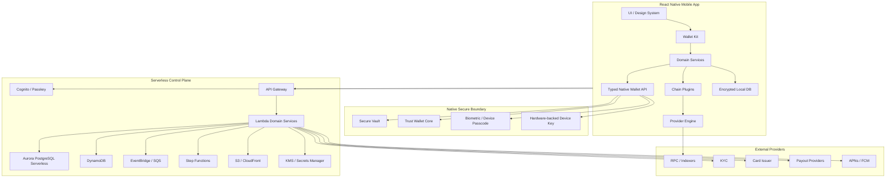
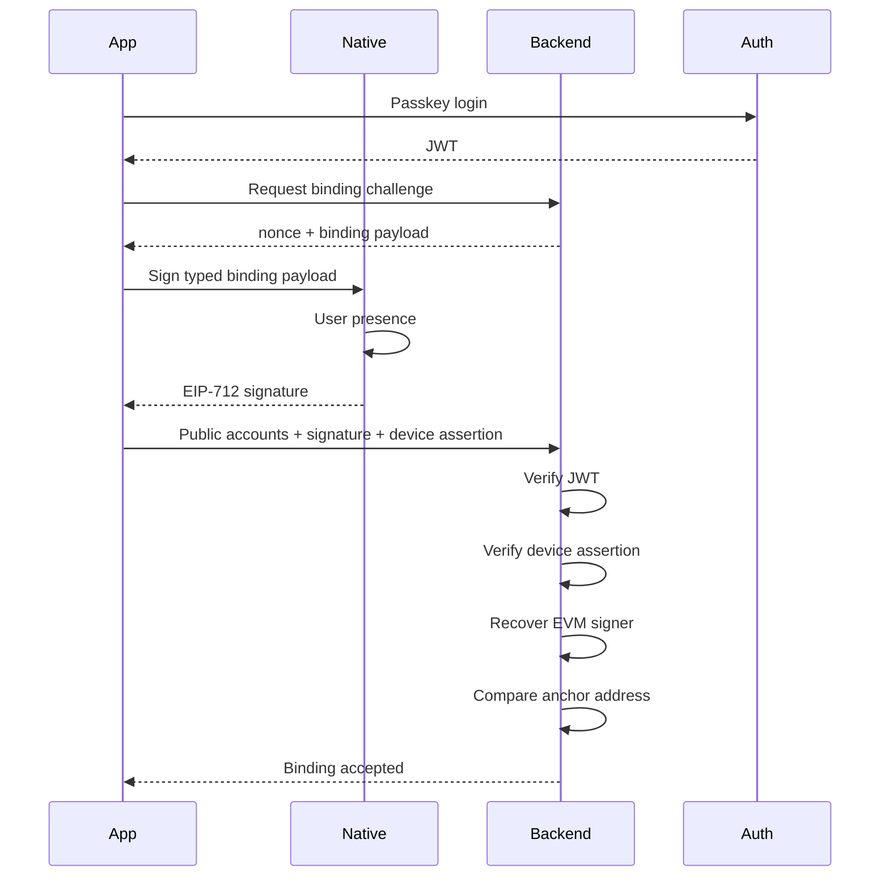
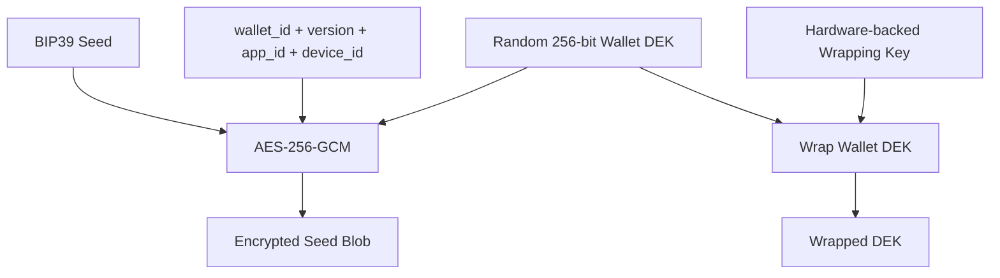
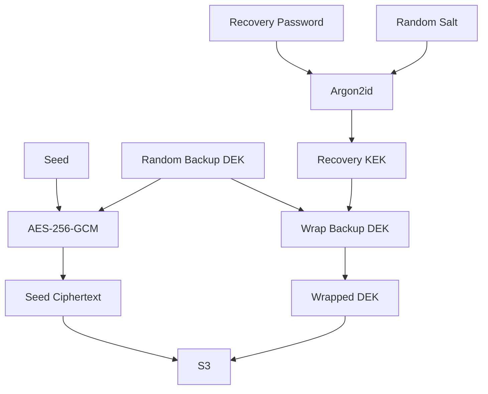

# 最終安全架構與開發規格
## 用戶資產保護、帳號—錢包關聯、React Native 多鏈錢包與 Serverless 支付平台

> **文件狀態：FINAL / 開發唯一安全基線**  
> **文件版本：5.0**  
> **文件日期：2026-08-13**  
> **適用產品：Stablecoin-first Global Payment Wallet**  
> **目標體驗：註冊、登入、自動建立錢包、多鏈收付、後續接入 KYC、卡片、全球付款**  
> **客戶端：React Native + TypeScript**  
> **錢包核心：Trust Wallet Core + Typed Native Module**  
> **後端：Serverless-first，必要工作負載可升級至容器**  
> **第一版錢包模式：本地非託管 24 詞錢包**  
> **後續恢復模式：端到端加密備份、可選 MPC / Embedded Wallet**  
> **最高原則：伺服器、資料庫、管理員、RPC 供應商均不得單獨取得用戶資產控制權**

---

# 目錄

1. [必須先說明：不存在 100% 絕對安全](#1-必須先說明不存在-100-絕對安全)
2. [最終結論](#2-最終結論)
3. [加密貨幣實際保存在哪裡](#3-加密貨幣實際保存在哪裡)
4. [安全不變量](#4-安全不變量)
5. [最終產品模式](#5-最終產品模式)
6. [總體架構](#6-總體架構)
7. [帳號、設備與錢包三層分離](#7-帳號設備與錢包三層分離)
8. [帳號與錢包的安全關聯協議](#8-帳號與錢包的安全關聯協議)
9. [設備註冊與硬體身分](#9-設備註冊與硬體身分)
10. [註冊、登入與自動建立錢包](#10-註冊登入與自動建立錢包)
11. [新設備登入與錢包恢復](#11-新設備登入與錢包恢復)
12. [Native Wallet Security 邊界](#12-native-wallet-security-邊界)
13. [助記詞、Seed 與派生規格](#13-助記詞seed-與派生規格)
14. [本地 Secure Vault 密鑰階層](#14-本地-secure-vault-密鑰階層)
15. [iOS 安全實現](#15-ios-安全實現)
16. [Android 安全實現](#16-android-安全實現)
17. [React Native 與 Native Module 安全接口](#17-react-native-與-native-module-安全接口)
18. [交易確認與本地簽名](#18-交易確認與本地簽名)
19. [高風險交易保護](#19-高風險交易保護)
20. [Chain Plugin 與 Provider Engine](#20-chain-plugin-與-provider-engine)
21. [第一版多鏈範圍](#21-第一版多鏈範圍)
22. [穩定幣聚合與防錯](#22-穩定幣聚合與防錯)
23. [Serverless 帳戶與支付後端](#23-serverless-帳戶與支付後端)
24. [後端資料隔離與加密](#24-後端資料隔離與加密)
25. [公開地址如何安全保存](#25-公開地址如何安全保存)
26. [資料庫模型](#26-資料庫模型)
27. [API 設計](#27-api-設計)
28. [帳號—錢包關聯的精確 API 流程](#28-帳號錢包關聯的精確-api-流程)
29. [可選端到端加密雲端備份](#29-可選端到端加密雲端備份)
30. [MPC / Embedded Wallet 升級方案](#30-mpc--embedded-wallet-升級方案)
31. [自託管錢包與支付餘額的分離](#31-自託管錢包與支付餘額的分離)
32. [卡片與全球付款的資金流程](#32-卡片與全球付款的資金流程)
33. [公司 Treasury 與 Settlement 安全](#33-公司-treasury-與-settlement-安全)
34. [鏈上監聽、通知與隱私](#34-鏈上監聽通知與隱私)
35. [身份驗證與 Passkey](#35-身份驗證與-passkey)
36. [App Attestation 與裝置完整性](#36-app-attestation-與裝置完整性)
37. [風控與反詐騙](#37-風控與反詐騙)
38. [靜態簽名配置與緊急開關](#38-靜態簽名配置與緊急開關)
39. [移動端安全硬化](#39-移動端安全硬化)
40. [後端與雲端安全硬化](#40-後端與雲端安全硬化)
41. [管理後台與內部人員風險](#41-管理後台與內部人員風險)
42. [開源與供應鏈安全](#42-開源與供應鏈安全)
43. [日誌、分析與隱私](#43-日誌分析與隱私)
44. [威脅模型與控制矩陣](#44-威脅模型與控制矩陣)
45. [事件應變與資產救援](#45-事件應變與資產救援)
46. [安全測試與外部審計](#46-安全測試與外部審計)
47. [發布與灰度策略](#47-發布與灰度策略)
48. [分階段開發計畫](#48-分階段開發計畫)
49. [團隊與權責](#49-團隊與權責)
50. [完整驗收標準](#50-完整驗收標準)
51. [禁止事項](#51-禁止事項)
52. [核心 TypeScript 接口](#52-核心-typescript-接口)
53. [帳號—錢包關聯訊息格式](#53-帳號錢包關聯訊息格式)
54. [資料與事件範例](#54-資料與事件範例)
55. [官方安全依據](#55-官方安全依據)
56. [最終 Definition of Done](#56-最終-definition-of-done)

---

# 1. 必須先說明：不存在 100% 絕對安全

任何連網熱錢包、手機作業系統、區塊鏈、第三方 SDK、RPC、雲端平台及人類操作都可能出現：

- 零日漏洞
- 供應鏈污染
- 裝置失竊
- 惡意輸入法或剪貼板程式
- Root / Jailbreak
- 釣魚
- 助記詞外洩
- 錯誤地址
- 智能合約漏洞
- RPC 欺騙
- 內部人員濫權
- 使用者操作錯誤

因此不得對外宣稱：

```text
100% 絕對安全
永遠不會被攻擊
資產永遠不會損失
```

本方案的安全目標是：

> **消除單點控制、縮小爆炸半徑、使後端或帳戶被攻破時仍無法直接偷走用戶資產，並讓每個高風險操作都需要用戶本地明確授權。**

正式對外用語建議：

```text
採用多層防禦、硬體保護密鑰、本地簽名、
無單點私鑰控制及持續安全審計。
```

---

# 2. 最終結論

## 2.1 推薦模式

```text
雲端帳戶：
註冊、登入、KYC、卡片、全球付款、通知與風控

本地錢包：
助記詞、Seed、私鑰、地址派生與交易簽名

後端資料庫：
只保存公開地址、公開金鑰、錢包狀態及加密備份密文

支付資金層：
只處理用戶明確轉入或授權的金額
```

## 2.2 第一版

第一版使用：

```text
LOCAL_SEED
```

特性：

- 24 詞 BIP39
- 手機本地生成
- 手機本地加密
- 私鑰不進 JavaScript
- 私鑰不上傳後端
- 本地簽名
- 後端只登記公開地址
- 帳戶與錢包使用密碼學證明綁定

## 2.3 後續

```text
V1.1：端到端加密雲端備份
V2：可選 MPC / Embedded Wallet
V2+：硬體錢包、企業多簽
```

---

# 3. 加密貨幣實際保存在哪裡

## 3.1 正確理解

用戶的 USDT、BTC、ETH 並不是保存在手機、資料庫或 AWS。

加密貨幣實際存在於：

```text
區塊鏈帳本
```

錢包保存的是：

```text
控制區塊鏈資產的密鑰
```

## 3.2 三類資料

### 區塊鏈保存

- 餘額
- Token 持有量
- 交易
- 智能合約狀態

### 手機保存

- 助記詞
- Seed
- 私鑰
- 本地加密密鑰
- 簽名權限

### 後端保存

- user_id
- wallet_id
- 公開地址
- 公開金鑰
- KYC 狀態
- 卡片狀態
- 付款訂單
- 安全事件
- 加密備份密文

## 3.3 最重要的設計結果

即使發生：

```text
AWS 資料庫外洩
Cognito 帳戶被接管
客服後台被入侵
RPC 供應商被攻破
```

攻擊者也不應取得：

```text
助記詞
Seed
私鑰
可直接簽名的完整密鑰
```

---

# 4. 安全不變量

以下條件在任何版本中都不得被破壞。

## S-01 後端不能偷走資產

後端被完整攻破時，攻擊者不得取得用戶私鑰或未經用戶批准的簽名能力。

## S-02 帳戶接管不能等於資產接管

僅取得 Email、OTP、JWT 或 Cognito 帳戶，不足以轉走鏈上資產。

## S-03 JavaScript 不接觸秘密

React Native JavaScript Heap 不得出現：

- 助記詞
- Seed
- 私鑰
- Vault DEK
- Recovery Key

## S-04 管理員不能導出密鑰

任何管理後台、客服工具、SQL 權限或 Lambda 角色都不得取得用戶密鑰。

## S-05 RPC 不能改變簽名內容

RPC 只能提供鏈上資料；最終簽名 Payload 必須在 Native 層重新驗證。

## S-06 用戶必須清楚看到簽名內容

每筆交易在簽名前必須顯示：

- 網絡
- 資產
- 合約
- 收款地址
- 金額
- 手續費
- Memo / Tag
- 風險警告

## S-07 無單一第三方持有完整私鑰

即使後續加入 MPC，也不得讓單一 SaaS 或公司服務器持有完整密鑰。

## S-08 支付供應商不得控制用戶全錢包

卡片、Nium、Bridge 或其他付款供應商只能處理：

- 已轉入支付層的資金
- 已鎖定的資金
- 用戶逐筆明確授權的金額

## S-09 資料庫餘額不等於鏈上資產

自託管錢包以區塊鏈為真實來源。

支付餘額以雙重記帳 Ledger 為真實來源。

## S-10 發布前無已知 Critical / High

任何 Critical 或 High 漏洞未修復時，不得發布主網版本。

---

# 5. 最終產品模式

```ts
export type WalletMode =
  | 'LOCAL_SEED'
  | 'ENCRYPTED_BACKUP'
  | 'MPC_EMBEDDED'
  | 'HARDWARE'
  | 'WATCH_ONLY';
```

## 5.1 LOCAL_SEED

- 第一版默認
- 24 詞
- 本地私鑰
- 後端無法恢復
- 安全性與自主權最高
- 用戶備份責任較高

## 5.2 ENCRYPTED_BACKUP

- Seed 在手機本地加密
- 後端只保存密文
- 復原密鑰不由服務器單獨掌握
- 新設備可恢復

## 5.3 MPC_EMBEDDED

- 接近普通金融 App 體驗
- 無單一完整私鑰
- 支持 Passkey / 多設備恢復
- 需額外供應商、審計與政策引擎

## 5.4 HARDWARE

- Ledger、OneKey 硬體或 QR 硬體錢包
- 私鑰不進手機
- 後期加入

## 5.5 WATCH_ONLY

- 只查看公開地址
- 不具簽名權
- 不可標記為可用支付錢包

---

# 6. 總體架構



---

# 7. 帳號、設備與錢包三層分離

## 7.1 User Account

代表產品身份：

```text
user_id
email
phone
passkeys
KYC
cards
payout profile
risk status
preferences
```

## 7.2 Device Identity

代表已註冊設備：

```text
device_id
hardware-backed public key
App Attest / Play Integrity
push token
trusted status
last seen
risk level
```

## 7.3 Wallet Identity

代表鏈上控制權：

```text
wallet_id
wallet mode
wallet fingerprint
public accounts
ownership proof
backup status
```

## 7.4 關係

```text
User
 ├── Device A
 │    ├── Device Key A
 │    └── Wallet A local vault
 ├── Device B
 │    ├── Device Key B
 │    └── Wallet A restored vault
 └── Payment Profile
      ├── KYC
      ├── Cards
      └── Payouts
```

## 7.5 強制規則

登入成功只代表：

```text
雲端身份已驗證
```

不代表：

```text
私鑰已恢復
```

---

# 8. 帳號與錢包的安全關聯協議

## 8.1 需要解決的問題

後端需要知道：

```text
哪一個 user_id 對應哪一個 wallet_id
哪一些公開地址屬於該錢包
目前是哪一台設備
用戶是否真的控制該錢包
```

但後端不能要求用戶上傳私鑰。

## 8.2 三重證明

帳號與錢包關聯使用三種獨立證明：

```text
1. Cloud Identity Proof
   Passkey / Cognito JWT

2. Device Proof
   Hardware-backed Device Key + App Attestation

3. Wallet Ownership Proof
   Seed-derived EVM Anchor Account EIP-712 Signature
```

## 8.3 Wallet Anchor

每一個 BIP39 多鏈錢包均派生固定 EVM Anchor Account：

```text
m/44'/60'/0'/0/0
```

用途：

- 計算可恢復的 Wallet Fingerprint
- 簽署帳號綁定 Challenge
- 新設備恢復時證明控制權

它不授予服務器轉帳權限。

## 8.4 Wallet Fingerprint

```text
wallet_fingerprint =
SHA-256(
  "PAYMENT-WALLET-FINGERPRINT-V1"
  || evm_anchor_public_key
)
```

不得使用：

- 助記詞 Hash
- Seed Hash
- 私鑰 Hash
- 可反推出秘密的資料

## 8.5 初次關聯



## 8.6 後端驗證

後端必須：

- 驗證 JWT
- 驗證 App Attest / Play Integrity
- 驗證 Device Key 簽名
- 驗證 Challenge 未使用
- 驗證 Challenge 未過期
- 驗證 EIP-712 Domain
- 從簽名恢復地址
- 比對 EVM Anchor Address
- 比對 `addressSetHash`
- 以 Transaction 寫入綁定
- 將 Challenge 標記為已使用

## 8.7 新設備重新關聯

新設備必須同時具備：

```text
Cloud Account Access
+
Wallet Recovery Material
```

流程：

1. Passkey / 高強度帳戶驗證
2. 新設備註冊和 Attestation
3. 用戶輸入 24 詞或解密備份
4. 本地派生 EVM Anchor
5. 服務器發 REBIND Challenge
6. 本地簽名
7. 服務器比對原 Wallet Fingerprint
8. 新設備加入 Wallet Binding
9. 舊設備收到通知
10. 高風險功能設冷卻期

## 8.8 攻擊防護

### 僅帳戶被盜

攻擊者沒有 Seed，不能生成 Wallet Ownership Proof。

### 僅 Seed 被盜

攻擊者沒有 Cloud Account / Passkey，不能無聲綁定支付帳戶。

但 Seed 被盜者仍能使用其他錢包直接轉走鏈上資產，因此必須提醒用戶立即遷移資產。

### 後端被盜

後端只有公開地址和簽名證明，不能簽署鏈上交易。

---

# 9. 設備註冊與硬體身分

## 9.1 Device Key

每台設備建立一組獨立 P-256 Device Key：

```text
iOS：Secure Enclave
Android：StrongBox 或 TEE-backed Keystore
```

私鑰不可匯出。

## 9.2 用途

Device Key 只用於：

- 設備註冊
- API Challenge 簽名
- 高風險操作設備證明
- 防止 JWT 被複製到其他設備

不作區塊鏈簽名。

## 9.3 Device Registration

```text
POST /v1/devices/challenge
POST /v1/devices/register
```

註冊資料：

```text
device_id
device_public_key
attestation
platform
app_version
signing_certificate
security_level
```

## 9.4 Server-side Attestation

必須在服務端驗證：

- Apple App Attest
- Google Play Integrity
- Android Hardware Key Attestation
- 憑證鏈
- Nonce / Challenge
- Bundle ID / Package Name
- App signing identity
- App version
- Replay

## 9.5 風險分層

```text
TRUSTED_HARDWARE
TRUSTED_SOFTWARE
LIMITED
UNTRUSTED
REVOKED
```

不同等級決定：

- 是否可建立錢包
- 是否可啟用加密備份
- 是否可申請卡片
- 是否可進行高額付款

---

# 10. 註冊、登入與自動建立錢包

## 10.1 推薦流程

```text
1. 選擇國家與語言
2. Email / Phone 驗證
3. 建立 Passkey
4. 建立 Device Key
5. 完成 App Attestation
6. 設定 8–12 位 App PIN
7. Native 模組本地建立 24 詞錢包
8. 本地加密保存
9. 派生多鏈公開地址
10. 進行 Wallet Binding
11. 顯示備份流程
12. 備份完成後啟用主網收付
```

## 10.2 後端故障時

本地錢包仍可建立。

狀態機：

```text
ACCOUNT_READY
DEVICE_READY
WALLET_LOCAL_READY
BINDING_PENDING
BACKUP_PENDING
READY
```

後端恢復後重試綁定。

## 10.3 防止重複建立

Native 保存：

```text
wallet_creation_operation_id
wallet_id
vault_state
creation_state
```

崩潰後：

- 繼續原流程
- 不靜默生成第二套 Seed
- 不覆蓋舊 Vault

---

# 11. 新設備登入與錢包恢復

## 11.1 登入只恢復雲端資料

可恢復：

- Profile
- KYC
- Card status
- Payout history
- Device list

不可直接恢復：

- Seed
- Private Key

## 11.2 V1 恢復

```text
24 詞助記詞
```

## 11.3 V1.1 恢復

```text
端到端加密備份
+
Recovery Password / Recovery Code
```

## 11.4 新設備安全流程

- 新設備通知
- 24 小時可配置冷卻期
- 舊設備確認
- 高額支付暫停
- 卡片狀態可暫時鎖定
- KYC 高風險重新驗證

---

# 12. Native Wallet Security 邊界

```text
React Native / TypeScript
       │ 只傳公開資料和 Typed Intent
       ▼
WalletNative Turbo Module
       │
       ├── Secure Vault
       ├── Trust Wallet Core
       ├── User Presence
       ├── Native Confirmation UI
       └── Memory Zeroization
```

## 12.1 禁止傳出 Native

```text
Mnemonic
Seed
Private Key
Wallet DEK
Recovery Key
Decrypted Backup
```

## 12.2 允許傳出

```text
wallet_id
fingerprint
public key
address
signed raw transaction
transaction hash
public error code
```

---

# 13. 助記詞、Seed 與派生規格

## 13.1 新錢包

```text
BIP39
24 English words
256-bit entropy
Empty optional passphrase in V1
```

## 13.2 安全隨機數

使用：

- iOS `SecRandomCopyBytes`
- Android `SecureRandom`
- Trust Wallet Core 安全接口

禁止：

- `Math.random`
- Timestamp
- UUID
- Server-generated seed
- Analytics ID
- Fixed test entropy in Production

## 13.3 導入

允許：

```text
12 / 15 / 18 / 21 / 24 words
```

新建仍固定 24 詞。

## 13.4 派生

使用：

- BIP32
- BIP44
- SLIP-0010（適用 ed25519 等鏈）
- 各鏈正式派生路徑

## 13.5 每個用戶獨立 Seed

禁止：

```text
Company Master Seed
 ├── User A
 ├── User B
 └── User C
```

---

# 14. 本地 Secure Vault 密鑰階層



## 14.1 Wallet DEK

- 每個錢包獨立
- 256 bits
- CSPRNG
- 不重用
- 不上傳
- 不進 JS

## 14.2 加密

推薦：

```text
AES-256-GCM
Unique 96-bit nonce
128-bit authentication tag
```

每次加密使用新 Nonce。

## 14.3 AAD

```text
app_bundle_id
wallet_id
vault_version
device_id
environment
```

防止密文被搬到另一錢包或環境。

## 14.4 Atomic Write

```text
write temp
fsync
verify
atomic rename
delete old after success
```

## 14.5 Anti-rollback

Vault Header：

```text
version
monotonic_revision
created_at
cipher
kdf
device_binding
```

低版本 Vault 不得覆蓋高版本。

---

# 15. iOS 安全實現

## 15.1 Keychain

Wrapping Key 使用：

```text
kSecAttrAccessibleWhenPasscodeSetThisDeviceOnly
ThisDeviceOnly
SecAccessControl
biometryCurrentSet / userPresence
```

## 15.2 Secure Enclave

Secure Enclave 使用 P-256 硬體密鑰保護：

- Device Key
- Vault wrapping / key agreement

區塊鏈常用 secp256k1 私鑰不能直接假設由 Secure Enclave 原生簽署。

正確方式：

```text
Secure Enclave P-256 key
       ↓ 保護
Wallet DEK
       ↓ 解密
Seed 在 Native 記憶體短暫使用
       ↓
Trust Wallet Core 鏈上簽名
```

## 15.3 必須要求設備密碼

設備沒有系統 Passcode 時：

- 禁止建立正式主網錢包
- 允許 Watch-only 或教育頁
- 提示設定系統密碼

## 15.4 畫面

- 助記詞頁檢測錄屏
- App Switcher 遮罩
- 背景立即鎖定
- 禁止 Screenshot
- 禁止 Clipboard

## 15.5 iCloud

不得通過：

- Keychain Synchronizable
- iCloud Drive
- App backup

自動備份未加密 Seed。

---

# 16. Android 安全實現

## 16.1 Android Keystore

Wrapping Key：

- AndroidKeyStore
- UserAuthenticationRequired
- TEE-backed
- StrongBox 優先
- Key Attestation

## 16.2 Hardware Attestation

服務端驗證：

- Google Attestation Root
- Certificate Chain
- TrustedEnvironment / StrongBox
- Revocation
- Challenge
- App identity

## 16.3 StrongBox 不可用

不得因 StrongBox 不可用直接崩潰。

策略：

```text
StrongBox
  ↓ fallback
TEE
  ↓ risk decision
Limited device
```

純軟體安全級別：

- 顯示高風險
- 可禁止高額功能
- 可禁止加密備份
- 可禁止卡片綁定

## 16.4 Android Backup

關閉或排除：

- Seed Blob
- Wrapped DEK
- Local wallet DB
- Secure preferences

## 16.5 FLAG_SECURE

以下頁面強制：

- Mnemonic
- Recovery
- Private Key Import
- Transaction final confirmation
- Backup code

---

# 17. React Native 與 Native Module 安全接口

## 17.1 Codegen Spec

使用 React Native New Architecture / Turbo Native Module / Codegen。

## 17.2 允許接口

```ts
createWallet()
importMnemonicSecureView()
derivePublicAccounts()
createWalletBindingSignature()
prepareTypedTransfer()
signTypedTransfer()
showMnemonicSecurely()
verifyMnemonicBackup()
lockWallet()
unlockWallet()
deleteWallet()
```

## 17.3 禁止接口

```ts
getMnemonic()
getSeed()
getPrivateKey()
rawSign()
signArbitraryBytes()
dumpVault()
disableBiometricsSilently()
```

## 17.4 Secret Types

Native 中使用 Byte Buffer，不使用：

- Swift `String`
- Java `String`
- JavaScript string
- JSON secret payload

## 17.5 記憶體

- 最短生命週期
- 用後覆寫
- 避免複製
- 禁止 Crash dump
- 禁止 Debug print
- 禁止 Core dump

---

# 18. 交易確認與本地簽名

## 18.1 流程

```text
UI 輸入
  ↓
Chain Plugin 建構意圖
  ↓
Provider 查鏈上資料
  ↓
Native 重新驗證
  ↓
Native Secure Confirmation
  ↓
User Presence
  ↓
Trust Wallet Core 簽名
  ↓
返回 Signed Raw Tx
  ↓
廣播
```

## 18.2 Native 最終確認

最高安全模式下，最終確認頁由 Native 顯示，避免：

- JS Bundle 被篡改
- React Native 畫面與實際 Payload 不一致
- Overlay 欺騙

## 18.3 Display Hash

```text
display_hash =
SHA-256(canonical transaction display model)
```

簽名 Payload 包含 `display_hash`。

確認後任何字段變化都要求重新確認。

## 18.4 Typed Transfer

V1 只允許：

```text
NATIVE_TRANSFER
TOKEN_TRANSFER
```

默認禁止：

```text
RAW_TRANSACTION
UNKNOWN_CONTRACT_CALL
BLIND_MESSAGE
UNLIMITED_APPROVAL
```

---

# 19. 高風險交易保護

## 19.1 可配置策略

- 新收款地址提示
- 地址白名單
- 高額冷卻期
- Passkey 重新驗證
- 生物識別
- TOTP
- 新設備限制
- Root / Jailbreak 限制
- 交易頻率限制
- 單日金額提醒

## 19.2 高風險條件

- 新設備 24 小時內
- 新國家
- 裝置完整性失敗
- 大額
- 首次地址
- 惡意地址命中
- RPC 資料不一致
- Gas 異常
- Token 合約未驗證

## 19.3 Self-custody 限制

用戶持有 24 詞後，可在其他錢包繞過本 App 風控。

因此 App 風控是保護措施，不是鏈上絕對控制。

---

# 20. Chain Plugin 與 Provider Engine

## 20.1 Chain Plugin

```ts
export interface ChainPlugin {
  id: string;
  family: ChainFamily;
  capabilities: ChainCapabilities;

  deriveAccounts(): Promise<Account[]>;
  validateAddress(): Promise<AddressValidation>;
  getBalances(): Promise<AssetBalance[]>;
  getTransactions(): Promise<TransactionPage>;
  estimateFee(): Promise<FeeQuote>;
  buildTransfer(): Promise<UnsignedTransaction>;
  buildSigningRequest(): Promise<TypedSigningRequest>;
  broadcast(): Promise<BroadcastResult>;
  getTransactionStatus(): Promise<TransactionStatus>;
}
```

## 20.2 Provider Router

```text
Primary
Secondary
Emergency
User Custom RPC
```

## 20.3 高價值查詢

對以下資料使用兩個獨立來源比對：

- Chain ID
- Latest Block
- Transaction confirmation
- Payment settlement
- Large-value balance

## 20.4 RPC 不可信

所有 RPC Response 視為未信任輸入：

- Schema validation
- Range validation
- Chain validation
- Block height validation
- Independent verification
- Timeout
- Circuit breaker

---

# 21. 第一版多鏈範圍

## V1

```text
EVM
TRON
Bitcoin / UTXO
Solana
TON
XRP Ledger
Stellar
```

## EVM 網絡

```text
Ethereum
BNB Chain
Polygon
Arbitrum
Optimism
Base
Avalanche C-Chain
Linea
Scroll
其他審核後 EVM
```

## V1.5

```text
Cosmos
Aptos
Sui
```

## V2

```text
Cardano
Polkadot / Substrate
NEAR
Algorand
Filecoin
Kaspa
```

---

# 22. 穩定幣聚合與防錯

```text
USDT
├── TRON
├── Ethereum
├── BNB Chain
├── Arbitrum
└── Solana

USDC
├── Ethereum
├── Base
├── Solana
└── Stellar
```

## 防錯

- Token 必須顯示 Network
- 收款前先選 Network
- QR 包含 Network Metadata
- TRON / EVM 格式錯誤直接阻斷
- XRP 顯示 Destination Tag
- Stellar 顯示 Memo
- TON 顯示 Comment
- 合約地址可展開
- 未驗證 Token 顯示紅色警告

---

# 23. Serverless 帳戶與支付後端

## 23.1 技術棧

```text
Amazon Cognito
API Gateway
Lambda
Aurora PostgreSQL Serverless v2
DynamoDB
EventBridge
SQS / SQS FIFO
Step Functions
S3 / CloudFront
KMS
Secrets Manager
WAF
CloudTrail
GuardDuty
Security Hub
```

## 23.2 Serverless-first

適合：

- 註冊
- 登入
- Wallet Registry
- KYC
- Card
- Payout
- Webhook
- Notification
- Audit
- Config

不適合：

- 完整區塊鏈節點
- 長期 Socket Listener
- 大型 Indexer
- 重型隱私鏈同步

這些後期使用 ECS Fargate / 專門節點。

---

# 24. 後端資料隔離與加密

## 24.1 四個安全域

```text
Identity Domain
Wallet Public Registry
Payment / Ledger Domain
KYC / PII Domain
```

不同：

- Database schema
- IAM role
- KMS key
- Service account
- Audit log

## 24.2 KMS

每個資料分類使用獨立 KMS Key。

使用 Encryption Context：

```text
service
environment
data_classification
record_type
```

## 24.3 KYC 隔離

KYC 文件：

- 不進普通 App DB
- 使用 Provider Token
- 文件存 S3 private bucket
- 獨立 KMS
- 短期 Signed URL
- 嚴格審計

## 24.4 無跨域直接 SQL

服務之間使用 API 或事件，不共享超級資料庫帳號。

---

# 25. 公開地址如何安全保存

公開地址雖然不是秘密，但把地址與實名帳戶連在一起屬於高敏感財務資料。

## 25.1 存儲格式

```text
address_ciphertext
address_blind_index
chain_id
wallet_id
account_index
derivation_path
```

## 25.2 Address Ciphertext

```text
AES-256-GCM
KMS envelope encryption
```

## 25.3 Blind Index

```text
address_blind_index =
HMAC-SHA256(
  address_index_key,
  chain_id || normalized_address
)
```

用途：

- 唯一性
- 查找
- 不建立明文索引

## 25.4 地址正規化

每條鏈獨立實現：

- EVM checksum / lowercase search form
- TRON Base58Check
- Bitcoin script/address type
- XRP classic / X-address
- Stellar base32
- TON workchain format

## 25.5 第三方 Indexer 隱私

若把地址傳給 RPC / Indexer，供應商可能觀察地址。

必須：

- 在隱私政策說明
- 使用多供應商
- 不攜帶 user_id
- 使用 pseudonymous watch_id
- 可選自建高敏感鏈 Indexer

---

# 26. 資料庫模型

## users

```text
id
cognito_sub
status
country
created_at
updated_at
```

## devices

```text
id
user_id
platform
device_public_key
attestation_type
attestation_status
security_level
trusted
revoked_at
last_seen_at
```

## wallets

```text
id
user_id
mode
status
fingerprint
created_device_id
backup_status
created_at
```

## wallet_accounts

```text
id
wallet_id
chain_id
account_index
derivation_path
public_key_ciphertext
address_ciphertext
address_blind_index
status
```

## wallet_bindings

```text
id
wallet_id
user_id
device_id
binding_version
anchor_address_blind_index
ownership_signature
address_set_hash
created_at
revoked_at
```

## binding_challenges

```text
id
user_id
device_id
wallet_id
action
nonce_hash
payload_hash
expires_at
used_at
```

## encrypted_backups

```text
id
wallet_id
version
ciphertext_location
cipher
nonce
salt
kdf
kdf_params
wrapped_dek
recovery_method
created_at
```

## security_events

```text
id
user_id
device_id
wallet_id
event_type
risk_score
ip
country
metadata
created_at
```

## transaction_intents

```text
id
wallet_id
chain_id
from_account_id
to_address_ciphertext
asset_id
amount_atomic
fee_quote
display_hash
status
expires_at
```

---

# 27. API 設計

```text
POST /v1/auth/post-signup
POST /v1/devices/challenge
POST /v1/devices/register
POST /v1/devices/assert

POST /v1/wallet-bindings/challenge
POST /v1/wallet-bindings/verify
POST /v1/wallet-bindings/rebind
DELETE /v1/wallet-bindings/{id}

GET  /v1/wallets
POST /v1/wallets/{walletId}/accounts
GET  /v1/wallets/{walletId}/backup-status

POST /v1/backups/init
POST /v1/backups/complete
GET  /v1/backups/{walletId}

POST /v1/transaction-intents
POST /v1/transaction-intents/{id}/signed
GET  /v1/transactions/{txHash}

POST /v1/kyc/cases
POST /v1/cards
POST /v1/payouts/quotes
POST /v1/payouts
```

## 所有寫操作

要求：

```text
Authorization
Idempotency-Key
Request-Id
Device-Signature
App-Attestation（高風險）
```

---

# 28. 帳號—錢包關聯的精確 API 流程

## 28.1 Challenge

```http
POST /v1/wallet-bindings/challenge
Authorization: Bearer <jwt>
X-Device-Id: <uuid>
X-Device-Signature: <signature>
```

Request：

```json
{
  "walletId": "uuid",
  "action": "BIND_WALLET",
  "anchorAddress": "0x...",
  "addressSetHash": "0x..."
}
```

Response：

```json
{
  "challengeId": "uuid",
  "nonce": "base64url",
  "issuedAt": 1786579200,
  "expiresAt": 1786579500,
  "typedData": {}
}
```

## 28.2 Verify

```http
POST /v1/wallet-bindings/verify
```

```json
{
  "challengeId": "uuid",
  "walletId": "uuid",
  "anchorAddress": "0x...",
  "addressSetHash": "0x...",
  "walletSignature": "0x...",
  "accounts": [
    {
      "chainId": "tron",
      "address": "T...",
      "derivationPath": "m/44'/195'/0'/0/0"
    },
    {
      "chainId": "ethereum",
      "address": "0x...",
      "derivationPath": "m/44'/60'/0'/0/0"
    }
  ]
}
```

## 28.3 驗證結果

成功後返回：

```json
{
  "bindingId": "uuid",
  "walletId": "uuid",
  "status": "ACTIVE"
}
```

## 28.4 Replay 防護

- Nonce 單次使用
- 5 分鐘有效
- Challenge 與 user/device/wallet 綁定
- Verify 使用 Database Transaction
- 重複 Signature 返回同一結果
- 不重複建立綁定

---

# 29. 可選端到端加密雲端備份

## 29.1 原則

服務端只保存密文。

## 29.2 加密流程



## 29.3 KDF

初始安全基線：

```text
Argon2id
Memory floor: 64 MiB
Target: 128 MiB on capable devices
Iterations: 3
Parallelism: 1–2
Calibration target: 750–1500 ms
Salt: 128 bits
```

最終參數需在真機測試後固定。

## 29.4 Recovery Password

不得使用：

- App PIN
- 6 位 OTP
- Email 密碼
- 手機號

要求：

- 獨立高強度密碼
- 或 128-bit Recovery Code

## 29.5 多包裝器

同一 Backup DEK 可分別被：

- Recovery Password KEK
- Recovery Code KEK
- 後期 Passkey PRF KEK

包裝。

服務端仍不能自行解密。

## 29.6 離線暴力破解風險

取得備份密文的攻擊者可離線猜 Recovery Password。

因此：

- 必須使用 Argon2id
- 必須要求高強度密碼
- 建議隨機 Recovery Code
- 不接受純數字 PIN

---

# 30. MPC / Embedded Wallet 升級方案

## 30.1 目的

提供接近 RedotPay 的體驗：

```text
登入帳戶
→ 自動恢復簽名能力
→ 不要求普通用戶手動輸入 24 詞
```

## 30.2 推薦 2-of-3

```text
Share A：用戶設備
Share B：MPC / HSM 服務
Share C：第二設備或恢復因子
```

任何一方不能單獨簽名。

## 30.3 安全要求

- 獨立安全審計
- Key share 不導出
- Policy Engine
- User Presence
- Device Binding
- Rate limits
- Address allowlist
- Transaction simulation
- Disaster recovery
- Provider exit plan

## 30.4 不自行發明 MPC

第一版禁止自研全套 MPC 密碼學。

應選：

- 經審計供應商
- 清晰的 key export / migration
- 無單方完整私鑰
- 可離線恢復或 Provider Exit

## 30.5 Local Seed 遷移至 MPC

不得把 Seed 明文上傳。

正確流程：

```text
建立新 MPC Wallet
  ↓
用戶在舊 Local Wallet 本地簽名
  ↓
轉移資產至新 MPC Wallet
  ↓
驗證完成
  ↓
保留舊助記詞恢復能力
```

---

# 31. 自託管錢包與支付餘額的分離

## 31.1 Self-Custody Balance

來源：

```text
Blockchain
```

## 31.2 Payment Balance

來源：

```text
Platform Double-entry Ledger
+
Provider settlement
```

## 31.3 不得直接把鏈上餘額當作卡片餘額

卡片授權需要：

- 可用餘額
- 鎖定
- 清算
- 退款
- Chargeback
- FX
- 負餘額
- 對帳

因此必須獨立 Ledger。

---

# 32. 卡片與全球付款的資金流程

## 32.1 最安全 V1

```text
用戶 Self-Custody Wallet
        ↓ 本地確認和簽名
Payment Top-up Address / Vault
        ↓ 確認
Platform Ledger Credit
        ↓
Card / Payout
```

## 32.2 優點

- 卡片供應商不接觸用戶全錢包
- 只暴露支付層金額
- 容易對帳
- 容易退款
- 不需要無限授權

## 32.3 後續 Smart Contract Vault

只有在：

- 鏈支持
- 合約完成獨立審計
- 支付供應商接受
- 法律模型清楚

後再使用：

- Delegated allowance
- Spending policy
- Collateral vault

## 32.4 V1 禁止

- 無限 ERC20 Approve
- 平台持有用戶主私鑰
- 卡片服務器直接簽用戶交易
- 後端任意拉走錢包資產

---

# 33. 公司 Treasury 與 Settlement 安全

公司資產與用戶錢包完全分離。

## 33.1 三層資金

```text
Hot：日常小額
Warm：2-of-3 / Policy-controlled
Cold：3-of-5 / Offline
```

## 33.2 Hot Wallet

- 嚴格餘額上限
- 自動 Sweep
- 地址白名單
- 每日限額
- 異常停機
- 不放主要儲備

## 33.3 Warm / Cold

- 多人批准
- 不同地理位置
- 不同硬體
- 最小 2 人原則
- 變更白名單需延遲
- 完整審計

## 33.4 Serverless 不保存 Treasury Key

Lambda：

- 不含 Treasury private key
- 不含 Seed
- 不直接執行高額簽名

簽名使用獨立 MPC / HSM Policy Service。

---

# 34. 鏈上監聽、通知與隱私

## 34.1 Watch-only Service

只使用公開地址：

```text
wallet_account_id
chain_id
address
```

不持有私鑰。

## 34.2 隔離

Watch service 只拿到：

```text
pseudonymous watch_id
encrypted address mapping
```

不直接拿到 KYC 資料。

## 34.3 通知

流程：

```text
Indexer detects transaction
→ Event
→ Resolve watch_id
→ Notification
```

## 34.4 高價值確認

支付入帳使用：

- 獨立 RPC
- 所需確認數
- Reorg 處理
- Token 合約白名單
- Amount validation
- Deposit address validation

---

# 35. 身份驗證與 Passkey

## 35.1 優先順序

```text
Passkey
TOTP
Email OTP
SMS fallback
```

SMS 不作唯一高風險驗證。

## 35.2 Cognito

Cognito 負責：

- Sign-up
- Sign-in
- JWT
- Passkey / WebAuthn
- MFA
- Session

## 35.3 Session

- 短期 Access Token
- Refresh Token rotation
- Device binding
- Revocation
- Risk-based reauthentication

## 35.4 高風險操作

要求 Passkey 重新驗證：

- 新設備綁定
- 恢復錢包
- 啟用加密備份
- 更改 KYC 聯絡資料
- 新增提款受益人
- 申請或解鎖卡片

---

# 36. App Attestation 與裝置完整性

## iOS

使用：

```text
App Attest
DeviceCheck
```

服務端驗證 App instance。

## Android

使用：

```text
Play Integrity
Hardware Key Attestation
```

## 原則

Attestation：

- 是風險信號
- 不是唯一身份
- 不是私鑰保護替代品
- 不支持的設備需要受限流程

---

# 37. 風控與反詐騙

## 37.1 信號

- Account age
- Device age
- Device integrity
- IP / Country
- SIM change
- New payee
- Amount velocity
- Failed OTP
- KYC status
- Address reputation
- Token reputation
- RPC inconsistency
- App version

## 37.2 結果

```text
ALLOW
ALLOW_WITH_WARNING
STEP_UP_AUTH
DELAY
REVIEW
BLOCK_PAYMENT_FEATURE
```

## 37.3 Self-custody

不得假裝能凍結鏈上自託管資產。

可以限制：

- 平台卡片
- 全球付款
- KYC
- 雲端備份
- 後端服務

---

# 38. 靜態簽名配置與緊急開關

## 38.1 Signed Config

離線 Ed25519 Key 簽名。

App 內置公鑰。

## 38.2 可控制

- RPC priority
- Token disable
- Network read-only
- Minimum version
- Provider disable
- Incident notice
- Feature flags

## 38.3 不可控制

- 用戶私鑰
- 自動簽名
- 任意轉帳
- 改派生路徑
- 開啟 Blind Signing
- 下載並執行任意代碼

---

# 39. 移動端安全硬化

- App background lock
- Screenshot protection
- Recording detection
- Clipboard protection
- Deep link allowlist
- Universal link validation
- WebView 默認禁用
- Root / Jailbreak detection
- Frida / Hooking signal
- Debugger detection
- Release symbol stripping
- R8 / ProGuard
- Native symbol controls
- Integrity checks
- Secure keyboard for mnemonic
- No custom keyboard on secret screen（能力允許時）
- Accessibility secret masking
- Auto-fill disabled
- No third-party SDK on secret screens
- No remote logging of secret flows

---

# 40. 後端與雲端安全硬化

## 40.1 AWS 多帳戶

```text
security / log archive
development
staging
production
```

## 40.2 IAM

- Least privilege
- No shared users
- SSO
- Hardware security key
- JIT access
- Short-lived credentials
- Permission boundaries
- SCP guardrails

## 40.3 Network

- Private subnets
- VPC endpoints
- No public DB
- WAF
- Rate limits
- Egress controls
- DNS logging

## 40.4 Secrets

- Secrets Manager
- Automatic rotation
- No secrets in Git
- No secrets in mobile
- No secrets in Lambda environment unless encrypted and scoped

## 40.5 Database

- Encryption
- PITR
- Immutable audit
- Backup
- Restore test
- Column encryption for sensitive records

---

# 41. 管理後台與內部人員風險

## 41.1 後台不能查看

- Seed
- Private Key
- Recovery Password
- Full encrypted backup plaintext
- Full card PAN（除受控 Provider UI）

## 41.2 敏感操作

需要：

- Two-person approval
- Reason
- Ticket
- Time-limited elevation
- Audit
- Notification

## 41.3 禁止功能

- Export all addresses
- Download all KYC
- Disable audit
- Arbitrary SQL in production
- Manual ledger balance edit

調帳必須使用雙重記帳 Adjustment Workflow。

---

# 42. 開源與供應鏈安全

## 42.1 依賴

- 固定版本
- Commit pin
- Lockfile
- SBOM
- License review
- Vulnerability scan
- No auto-merge security-critical updates

## 42.2 Trust Wallet Core

- 固定 Release
- 固定 Commit
- 固定 Artifact SHA-256
- 自行建置或驗證官方產物
- Android / iOS CI
- Signing vectors
- Upgrade review

## 42.3 NPM

- Disable install scripts where possible
- Registry allowlist
- Package provenance
- Maintainer change alerts
- Typosquat detection
- Lockfile diff review

## 42.4 CI

- OIDC cloud auth
- No long-lived AWS key
- Protected runners
- Signed artifacts
- Provenance
- Two-person release

---

# 43. 日誌、分析與隱私

## 43.1 永不記錄

- Mnemonic
- Seed
- Private Key
- PIN
- Recovery Password
- Recovery Code
- Decrypted Vault
- KYC document
- Full card PAN

## 43.2 地址

Analytics 不記完整地址。

必要排錯使用：

```text
HMAC(address, rotating diagnostic key)
```

## 43.3 Crash

全局 Sanitizer：

- Regex
- Secret canary
- Payload size limit
- Field allowlist

## 43.4 隱私

- Data minimization
- Retention policy
- User export
- User deletion
- KYC legal retention exception
- Third-party disclosure

---

# 44. 威脅模型與控制矩陣

| 威脅 | 主要控制 |
|---|---|
| AWS DB 外洩 | 無私鑰、地址加密、Blind Index、KMS |
| Cognito 帳戶被盜 | Wallet ownership proof、Device Key、Step-up |
| 手機失竊 | Passcode、Biometric、Auto-lock、Hardware wrapping |
| Root / Jailbreak | Risk restriction、Attestation、No JS secrets |
| 惡意 JS Bundle | Native final confirmation、Typed signing |
| 剪貼板替換 | QR、地址校驗、二次確認 |
| RPC MITM | TLS、Provider redundancy、Native verification |
| 惡意 RPC | Chain ID、雙源比對、Payload validation |
| 無限 Token Approve | V1 禁止、Clear signing |
| 供應鏈套件污染 | Pin、SBOM、Provenance、Review |
| 管理員濫權 | No keys、JIT、Two-person、Audit |
| Webhook 偽造 | Signature、Timestamp、Replay、Idempotency |
| 重複付款 | Idempotency、FIFO、Ledger transaction |
| 助記詞截圖 | Native secure screen、Screenshot block |
| 雲端備份外洩 | E2EE、Argon2id、Recovery Code |
| Seed 被使用者洩漏 | 教育、風險通知、遷移流程 |
| App 被重新打包 | App Attest / Play Integrity |
| SIM Swap | Passkey first、SMS fallback only |
| 新設備接管 | Wallet proof、cooldown、old-device alert |
| Provider 倒閉 | Adapter、exit plan、data export |
| Company hot wallet 被盜 | Limits、sweep、MPC/HSM、allowlist |

---

# 45. 事件應變與資產救援

## 45.1 後端被入侵

- Revoke sessions
- Rotate secrets
- Disable payment features
- Signed config read-only
- Verify no key exposure
- Notify affected users
- Preserve evidence

Self-custody 鏈上資產仍可由用戶控制。

## 45.2 Mobile signer 漏洞

- Emergency minimum version
- Disable vulnerable chain / transaction type
- Publish patched build
- Notify users to migrate
- Bug bounty coordination
- Store review escalation

## 45.3 Seed 疑似外洩

App 提供：

```text
Create new wallet
→ Show verified destination
→ Sweep all assets
→ Verify final balances
→ Revoke old binding
```

## 45.4 RPC 妥協

- Disable provider
- Compare independent provider
- Freeze payment credit
- Reprocess confirmations
- Do not move user assets automatically

## 45.5 MPC 供應商故障

- Provider exit procedure
- Recovery share
- New provider migration
- No vendor-only full key

---

# 46. 安全測試與外部審計

## 46.1 移動端

按 OWASP MASVS / MASTG 高保證範圍：

- Storage
- Crypto
- Auth
- Network
- Platform
- Code
- Resilience
- Privacy

## 46.2 後端

使用 OWASP ASVS 和雲端架構審查。

## 46.3 審計範圍

- Native Vault
- Wallet Core integration
- RN bridge
- Wallet binding
- EIP-712 proof
- Device attestation
- Encrypted backup
- Chain signing
- Payment ledger
- Webhook
- CI/CD
- Infrastructure

## 46.4 發布門檻

```text
Critical = 0
High = 0
Medium = 修復或書面接受
```

## 46.5 持續安全

- 每個 Major Release 審計
- 每年完整滲透測試
- 每季 Dependency Review
- 持續 Bug Bounty
- 重大 signer 變更重新審計

---

# 47. 發布與灰度策略

```text
Internal
→ TestFlight / Play Internal
→ 1%
→ 5%
→ 25%
→ 50%
→ 100%
```

每階段觀察：

- Crash
- Vault error
- Signing mismatch
- RPC error
- Failed transfer
- Account binding error
- Attestation failure
- Backup recovery success

---

# 48. 分階段開發計畫

## Phase 0：安全原型（2–3 週）

- Device Key
- App Attestation
- 24 詞 Native Wallet
- Secure Vault
- EVM / TRON address
- Wallet Binding
- Serverless Auth
- Public Registry

## Phase 1：核心錢包（4–5 週）

- EVM
- TRON
- Bitcoin
- Send / Receive
- Native confirmation
- Provider Router
- Portfolio

## Phase 2：支付主流鏈（4–5 週）

- Solana
- TON
- XRP
- Stellar
- Stablecoin aggregation
- Notification

## Phase 3：帳戶與恢復（3–4 週）

- Passkey
- Device management
- Encrypted backup
- Recovery
- Risk events
- Signed config

## Phase 4：支付層（4–6 週）

- KYC
- Payment top-up
- Ledger
- Card adapter
- Payout adapter
- Webhook / reconciliation

## Phase 5：審計與發布（4–6 週）

- External audit
- Fix
- Mainnet testing
- Incident drills
- Gradual rollout

## 預估

```text
安全錢包 Beta：12–16 週
支付平台 V1：20–28 週
```

---

# 49. 團隊與權責

推薦：

```text
1 Tech Lead
2 React Native / TypeScript
2 Blockchain
1 iOS Native Security
1 Android Native Security
2 Backend / AWS
1 QA Automation
1 Security Engineer
1 UI/UX
1 DevOps / Platform（可由 Backend 兼任）
```

角色分離：

```text
Security Owner
Release Owner
Treasury Owner
Compliance Owner
Incident Commander
```

---

# 50. 完整驗收標準

## 帳戶

- Passkey
- OTP fallback
- Device register
- Device revoke
- New device alert
- Account recovery

## 錢包

- 24 詞
- Local generation
- No JS secrets
- Keychain / Keystore
- Wallet Binding
- New device rebind
- Backup / restore
- Secure delete

## 交易

- Native final confirmation
- Typed signing
- Correct address
- Correct amount
- Correct fee
- No blind signing
- Replay protection

## 後端

- No private keys
- Address encryption
- Blind index
- KMS separation
- Idempotency
- Audit
- Webhook verification
- Double-entry ledger

## 安全

- MASVS review
- Backend ASVS review
- External audit
- Critical 0
- High 0
- SBOM
- Incident drills

---

# 51. 禁止事項

絕對禁止：

1. 後端生成用戶 Seed。
2. 將助記詞傳入 React Native JavaScript。
3. 將私鑰保存到普通 SQLite。
4. 使用 6 位 PIN 直接加密 Seed。
5. 使用公司 Master Seed 派生所有用戶。
6. 讓管理員下載用戶備份密文與恢復密鑰。
7. 在 Lambda 保存 Treasury Seed。
8. 允許 Blind Signing。
9. 允許無限 Token Approval。
10. 未驗證 App Attestation 就信任高風險設備。
11. 僅依靠 Root / Jailbreak 檢測。
12. 自動合併安全依賴更新。
13. 使用浮動 Git Branch。
14. 在日誌記錄地址與身份完整關聯。
15. 將卡片可用餘額直接等同鏈上餘額。
16. 使用單一 RPC 決定高價值入帳。
17. 未審計即開放主網。
18. 對外宣稱 100% 安全。

---

# 52. 核心 TypeScript 接口

```ts
export interface WalletNativeSpec {
  createWallet(input: {
    walletId: string;
    words: 24;
  }): Promise<{
    walletId: string;
    fingerprint: string;
    anchorAddress: string;
  }>;

  derivePublicAccounts(input: {
    walletId: string;
    requests: Array<{
      chainId: string;
      derivationPath: string;
    }>;
  }): Promise<PublicAccount[]>;

  signWalletBinding(input: {
    walletId: string;
    typedData: WalletBindingTypedData;
  }): Promise<{
    anchorAddress: string;
    signature: string;
  }>;

  signTypedTransaction(
    input: TypedSigningRequest,
  ): Promise<SignedTransaction>;

  showMnemonicSecurely(input: {
    walletId: string;
  }): Promise<void>;

  deleteWallet(input: {
    walletId: string;
  }): Promise<void>;
}
```

```ts
export interface DeviceSecurityService {
  registerDeviceKey(): Promise<DeviceKeyInfo>;
  attestDevice(challenge: string): Promise<AttestationResult>;
  signDeviceChallenge(payloadHash: string): Promise<string>;
}
```

---

# 53. 帳號—錢包關聯訊息格式

使用 EIP-712 Typed Data。

```json
{
  "domain": {
    "name": "Payment Wallet Binding",
    "version": "1",
    "chainId": 1,
    "salt": "0x<environment-domain-salt>"
  },
  "primaryType": "WalletBinding",
  "types": {
    "WalletBinding": [
      { "name": "action", "type": "string" },
      { "name": "userId", "type": "string" },
      { "name": "walletId", "type": "string" },
      { "name": "deviceId", "type": "string" },
      { "name": "walletFingerprint", "type": "bytes32" },
      { "name": "addressSetHash", "type": "bytes32" },
      { "name": "nonce", "type": "bytes32" },
      { "name": "issuedAt", "type": "uint64" },
      { "name": "expiresAt", "type": "uint64" }
    ]
  },
  "message": {
    "action": "BIND_WALLET",
    "userId": "uuid",
    "walletId": "uuid",
    "deviceId": "uuid",
    "walletFingerprint": "0x...",
    "addressSetHash": "0x...",
    "nonce": "0x...",
    "issuedAt": 1786579200,
    "expiresAt": 1786579500
  }
}
```

安全要求：

- Domain 固定
- Version 固定
- Environment 分離
- Nonce 單次
- 短期過期
- Signature 不作鏈上交易
- Server 防 Replay
- Challenge 與 JWT / Device 綁定

---

# 54. 資料與事件範例

## WalletRegistered

```json
{
  "id": "event_uuid",
  "type": "WalletRegistered",
  "version": 1,
  "occurredAt": "2026-08-13T00:00:00Z",
  "aggregateId": "wallet_uuid",
  "actorId": "user_uuid",
  "correlationId": "request_uuid",
  "payload": {
    "mode": "LOCAL_SEED",
    "bindingId": "binding_uuid"
  }
}
```

## SecurityEvent

```json
{
  "type": "NEW_DEVICE_WALLET_REBIND",
  "riskScore": 78,
  "decision": "COOLDOWN",
  "cooldownUntil": "2026-08-14T00:00:00Z"
}
```

---

# 55. 官方安全依據

## Trust Wallet Core

```text
https://developer.trustwallet.com/developer/wallet-core
https://developer.trustwallet.com/developer/wallet-core/integration-guide/wallet-core-usage
```

Wallet Core 負責：

- 地址派生
- 密碼學
- 交易簽名

不負責：

- RPC
- 餘額
- 廣播
- UI

## Apple

```text
https://developer.apple.com/documentation/security/restricting-keychain-item-accessibility
https://developer.apple.com/documentation/cryptokit/secureenclave/p256/signing
https://developer.apple.com/documentation/devicecheck
```

## Android

```text
https://developer.android.com/privacy-and-security/security-key-attestation
https://developer.android.com/google/play/integrity
```

## AWS

```text
https://docs.aws.amazon.com/whitepapers/latest/serverless-multi-tier-architectures-api-gateway-lambda/mobile-backend.html
https://docs.aws.amazon.com/cognito/
https://docs.aws.amazon.com/kms/
```

## Mobile Security

```text
https://mas.owasp.org/MASVS/
https://mas.owasp.org/MASTG/
```

## Key Management

```text
https://csrc.nist.gov/Projects/Key-Management/Key-Management-Guidelines
```

## Wallet Standards

```text
https://github.com/bitcoin/bips/blob/master/bip-0039.mediawiki
https://github.com/bitcoin/bips/blob/master/bip-0032.mediawiki
https://github.com/satoshilabs/slips/blob/master/slip-0010.md
https://eips.ethereum.org/EIPS/eip-712
```

---

# 56. 最終 Definition of Done

## 安全不變量

- [ ] 後端無私鑰
- [ ] 帳戶接管不能簽名
- [ ] JS 無 Seed
- [ ] 管理員無密鑰
- [ ] RPC 無簽名控制
- [ ] 支付供應商無全錢包控制

## 帳號—錢包關聯

- [ ] Passkey Identity Proof
- [ ] Device Hardware Proof
- [ ] Wallet EIP-712 Ownership Proof
- [ ] Challenge Replay 防護
- [ ] New device rebind
- [ ] Old device notification
- [ ] Binding revocation

## 本地錢包

- [ ] 24 詞
- [ ] 256-bit entropy
- [ ] Keychain / Keystore
- [ ] Hardware wrapping
- [ ] AES-256-GCM
- [ ] Native confirmation
- [ ] Typed signing
- [ ] Secure delete

## Serverless

- [ ] Cognito
- [ ] API Gateway
- [ ] Lambda
- [ ] Aurora
- [ ] DynamoDB
- [ ] EventBridge
- [ ] SQS
- [ ] Step Functions
- [ ] KMS
- [ ] WAF
- [ ] Audit

## 支付

- [ ] Self-custody / Payment balance separation
- [ ] Double-entry ledger
- [ ] Provider adapters
- [ ] Webhook verification
- [ ] Idempotency
- [ ] Reconciliation
- [ ] Treasury segregation

## 發布

- [ ] Threat Model
- [ ] External audit
- [ ] Critical 0
- [ ] High 0
- [ ] SBOM
- [ ] Mainnet testing
- [ ] Incident drills
- [ ] Gradual rollout

---

# 最終執行口令

> **用戶的加密貨幣保存在區塊鏈上；產品保護的是控制資產的私鑰。第一版私鑰只在手機 Native Secure Boundary 中生成、加密和使用，後端只保存公開地址及密碼學綁定證明。**

> **帳號和錢包的關聯必須同時驗證 Cloud Account、硬體設備及 Wallet Ownership Proof。任何一個單獨被攻破都不應足以轉走用戶資產。**

> **支付卡和全球付款不能直接控制用戶完整自託管錢包。用戶必須逐筆簽名，把明確金額轉入支付或 Settlement Layer，再由平台 Ledger、卡片及付款供應商處理。**

> **本方案不能誠實地承諾 100% 絕對安全，但它的核心目標是：後端被攻破不丟幣、帳戶被盜不丟幣、單一供應商被攻破不丟幣、單一管理員不能動幣，並通過外部審計、灰度發布和持續安全運營降低未知風險。**
